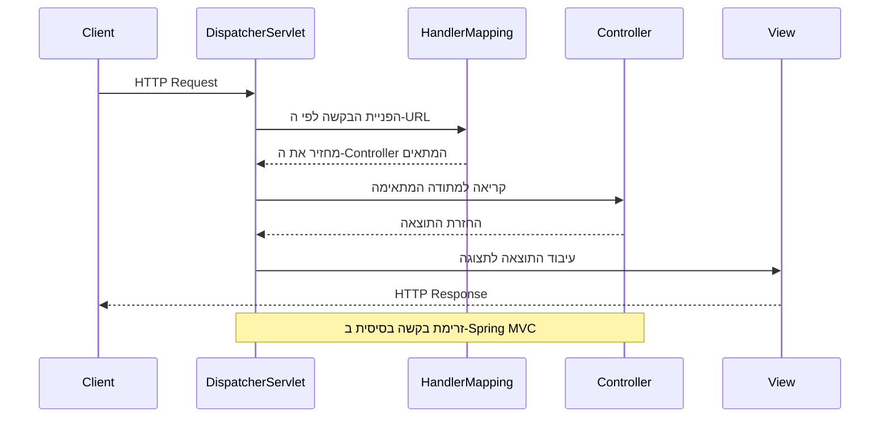

```mermaid

sequenceDiagram
    participant Client
    participant DS as DispatcherServlet
    participant HM as HandlerMapping
    participant C as Controller
    participant V as View

    Client->>DS: HTTP Request
    DS->>HM: הפניית הבקשה לפי ה-URL
    HM-->>DS: מחזיר את ה-Controller המתאים
    DS->>C: קריאה למתודה המתאימה
    C-->>DS: החזרת התוצאה
    DS->>V: עיבוד התוצאה לתצוגה
    V-->>Client: HTTP Response

    Note over DS,C: זרימת בקשה בסיסית ב-Spring MVC
```