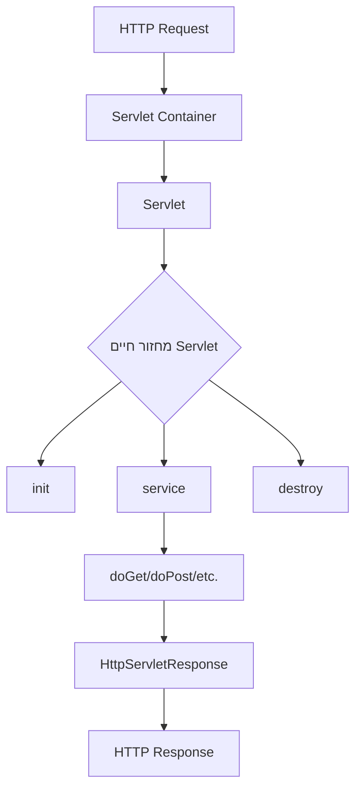
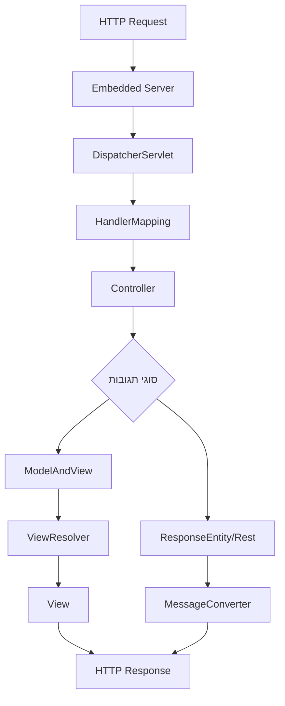

<div dir="rtl">

# Servlet ויישומו ב-Spring Boot

## מהו Servlet?

Servlet הוא רכיב תוכנה ב-Java שרץ בצד השרת ומשמש לטיפול בבקשות HTTP ויצירת תשובות דינמיות. Servlet מהווה חלק מארכיטקטורת Java EE (Enterprise Edition) והוא למעשה הבסיס לפיתוח אפליקציות ווב ב-Java.

### מאפיינים עיקריים של Servlet:

1. **מחזור חיים מוגדר**:
   * `init()` - נקרא פעם אחת בתחילת חיי ה-Servlet
   * `service()` - נקרא בכל פעם שמגיעה בקשה
   * `destroy()` - נקרא פעם אחת בסוף חיי ה-Servlet

2. **טיפול בבקשות**: Servlet מקבל בקשות HTTP (GET, POST, וכו') ומעבד אותן.

3. **יצירת תשובות**: Servlet מייצר תשובות HTTP דינמיות שנשלחות בחזרה ללקוח.

4. **ניהול סשן**: Servlet יכול לנהל סשנים (sessions) ולשמור על מצב בין בקשות שונות.

5. **מופעל בתוך Servlet Container**: Servlet רץ בתוך סביבת ריצה מיוחדת כמו Tomcat, Jetty או אפליקציות שרת אחרות התומכות ב-Java.

### זרימת העבודה של Servlet מסורתי:



### דוגמה בסיסית של Servlet מסורתי:

</div>

```java
import java.io.*;
import javax.servlet.*;
import javax.servlet.http.*;
import javax.servlet.annotation.WebServlet;

// WebServlet annotation maps this servlet to the "/hello" URL pattern
@WebServlet("/hello")
public class HelloServlet extends HttpServlet {
    
    @Override
    public void init() throws ServletException {
        // Initialization code that runs once when the servlet is created
        System.out.println("Servlet initialized");
    }
    
    @Override
    protected void doGet(HttpServletRequest request, HttpServletResponse response) 
            throws ServletException, IOException {
        
        // Set the content type and character encoding for the response
        response.setContentType("text/html;charset=UTF-8");
        
        // Get a PrintWriter to write the response content
        PrintWriter out = response.getWriter();
        
        // Write HTML content to the response
        out.println("<html>");
        out.println("<head><title>Hello Servlet</title></head>");
        out.println("<body>");
        out.println("<h1>Hello, World!</h1>");
        out.println("</body>");
        out.println("</html>");
    }
    
    @Override
    public void destroy() {
        // Cleanup code that runs when the servlet is being destroyed
        System.out.println("Servlet destroyed");
    }
}
```

<div dir="rtl">

## כיצד Spring Boot מיישם Servlet?

Spring Boot הוא מסגרת עבודה המבוססת על Spring ומספקת דרך פשוטה ומהירה ליצירת אפליקציות Spring עצמאיות. Spring Boot משתמש ב-Servlet כבסיס לניהול בקשות HTTP אך מסתיר את רוב המורכבות של עבודה ישירה עם Servlet.

### ה-DispatcherServlet ב-Spring Boot:

1. **הרשמה אוטומטית**: Spring Boot רושם אוטומטית את ה-DispatcherServlet ללא צורך בקובצי קונפיגורציה כמו web.xml.

2. **רכיב מרכזי**: ה-DispatcherServlet משמש כ"שער כניסה" לכל הבקשות ומנתב אותן לבקרים (Controllers) המתאימים.

3. **החלפת כתיבת Servlet ידני**: במקום לכתוב Servlet בצורה ידנית, מפתחים משתמשים ב-Controllers המוגדרים באמצעות אנוטציות.

### זרימת העבודה ב-Spring Boot:



### דוגמה ל-Controller ב-Spring Boot:

</div>

```java
import org.springframework.web.bind.annotation.GetMapping;
import org.springframework.web.bind.annotation.RestController;

// Marks this class as a REST controller which automatically handles HTTP requests
@RestController
public class HelloController {

   // Maps HTTP GET requests to the "/hello" path to this method
   @GetMapping("/hello")
   public String hello() {
      // Returns a simple string as the response body
      // Spring Boot automatically converts this to HTTP response with content type text/plain
      return "Hello, World!";
   }
}
```


<div dir="rtl">

## הבדלים בין Servlet מסורתי ל-Spring Boot:

| הבדל | Servlet מסורתי | Spring Boot |
|------|----------------|-------------|
| הגדרה | נדרשת הגדרה מפורשת ב-web.xml או אנוטציות | אוטומטית באמצעות אוטו-קונפיגורציה |
| כתיבת קוד | יש לממש את מחזור החיים המלא של Servlet | אין צורך להתעסק עם פרטי Servlet |
| ניתוב | נקבע בהגדרת ה-Servlet או אנוטציות | באמצעות אנוטציות פשוטות כמו @GetMapping |
| שימוש בבקשה/תשובה | גישה ישירה ל-HttpServletRequest/Response | הפשטה גבוהה, לרוב אין צורך לגשת ישירות לאובייקטים אלו |
| טיפול בשגיאות | נדרש קוד ידני | מנגנון מובנה וניתן להתאמה אישית |

## טיפול בשגיאות ב-Spring Boot:

1. **הטיפול בבקשות שאין להן Controller מתאים**:
   * ב-Spring Boot, ה-DispatcherServlet מעביר את הבקשה ל-BasicErrorController מובנה
   * ניתן להתאים אישית את התנהגות השגיאה:
      * יצירת templates/error/404.html
      * דריסת BasicErrorController
      * שימוש ב-ExceptionHandler


Spring Boot משתמש ב-Servlet כבסיס לטיפול בבקשות HTTP, אך מסתיר את רוב המורכבות מאחורי הפשטות וקונבנציות. ה-DispatcherServlet מהווה את ליבת המערכת ופועל כ"שער כניסה" לכל הבקשות, כאשר הוא מנתב אותן לבקרים (Controllers) המתאימים.

הודות לאוטו-קונפיגורציה של Spring Boot, המפתחים יכולים להתמקד ביצירת לוגיקה עסקית במקום בהגדרות ובקוד תשתיתי. יחד עם זאת, הבנה בסיסית של Servlet חשובה להבנת הארכיטקטורה הבסיסית של אפליקציות Spring Boot והדרך בה הן מטפלות בבקשות HTTP.
</div>