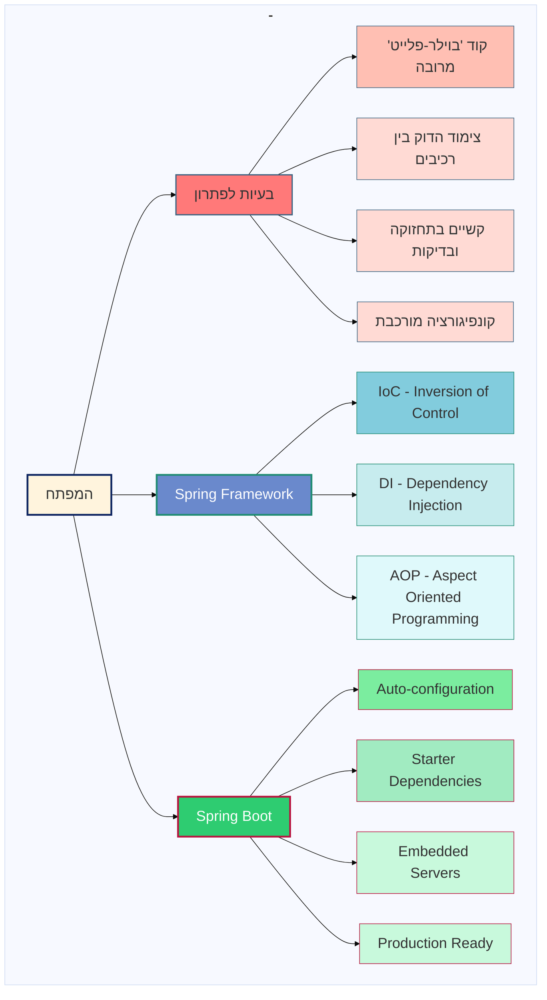
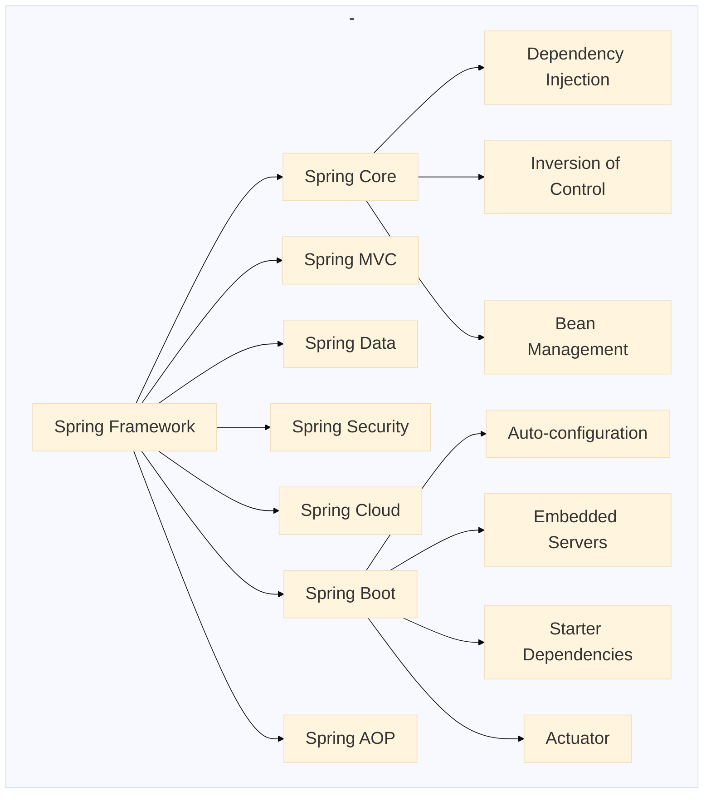
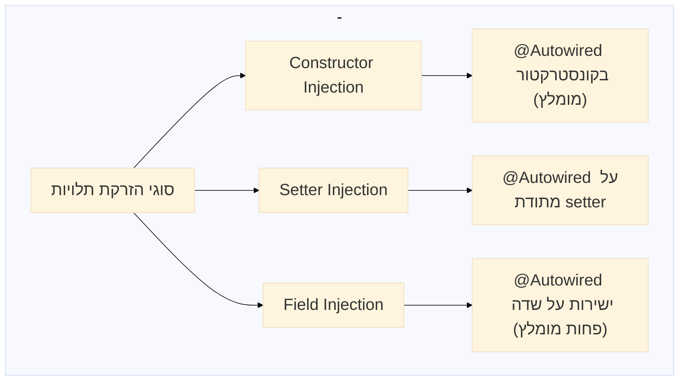

##  Spring Framework ו-Spring Boot

## אתגרי פיתוח נפוצים

מפתחים נתקלים במספר אתגרים משמעותיים בתהליך פיתוח יישומים:

### קוד 'בוילר-פלייט' מרובה

### צימוד הדוק בין רכיבים

### קשיים בתחזוקה ובדיקות

### קונפיגורציה מורכבת

## Spring Framework כפתרון

Spring Framework הוא מסגרת פיתוח המספקת פתרונות לבעיות הנ"ל באמצעות מספר עקרונות מרכזיים:

### IoC - Inversion of Control (היפוך שליטה)
* העברת האחריות לניהול אובייקטים מהקוד שלנו למסגרת עצמה

### DI - Dependency Injection (הזרקת תלויות)
* הזרקת תלויות אוטומטית במקום יצירה ידנית של אובייקטים

### AOP - Aspect Oriented Programming (תכנות מונחה היבטים)
* הפרדה של נושאים חוצי מערכת (cross-cutting concerns)

## Spring Boot - הרמה הבאה

Spring Boot מתבסס על Spring Framework ומוסיף שכבה נוספת של פתרונות:

### Auto-configuration (קונפיגורציה אוטומטית)
* הגדרה אוטומטית של רכיבים לפי הצורך והסביבה

### Starter Dependencies (חבילות התחלה)
* חבילות מוגדרות מראש המכילות את כל התלויות הנדרשות למשימה מסוימת

### Embedded Servers (שרתים מובנים)
* שרתים מוכללים כחלק מהיישום עצמו

### Production Ready (מוכנות לסביבת ייצור)
* כלים מובנים לניטור ומעקב אחר ביצועים

### מטרות הלימוד
1. היכרות עם עקרונות הבסיס של Spring Framework - IoC ו-Dependency Injection
2. הבנת היתרונות של ארכיטקטורה מבוססת שכבות
3. יצירת פרויקט Spring Boot בסיסי והבנת מבנהו
4. הכרת Spring Context ומנגנון ניהול Beans

## חלק 1: עקרונות בסיסיים של Spring Framework

### רקע ומבוא ל-Spring Framework
- סקירת המודולים המרכזיים ב-Framework
- הקשר בין Spring Framework ל-Spring Boot

### עקרונות IoC ו-DI

#### Inversion of Control (IoC)

#### Dependency Injection (DI)

#### סוגי הזרקת תלויות:

