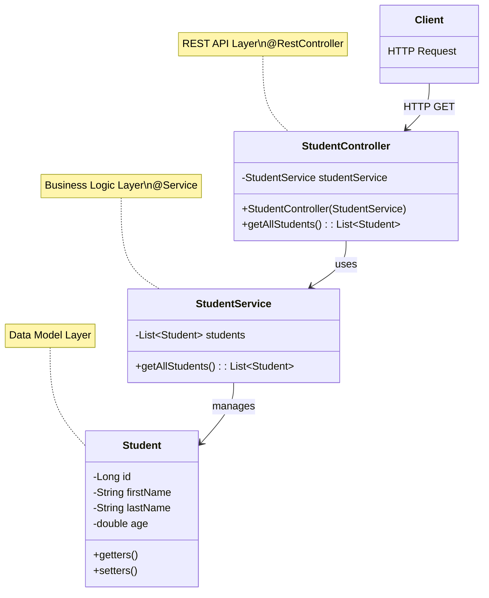
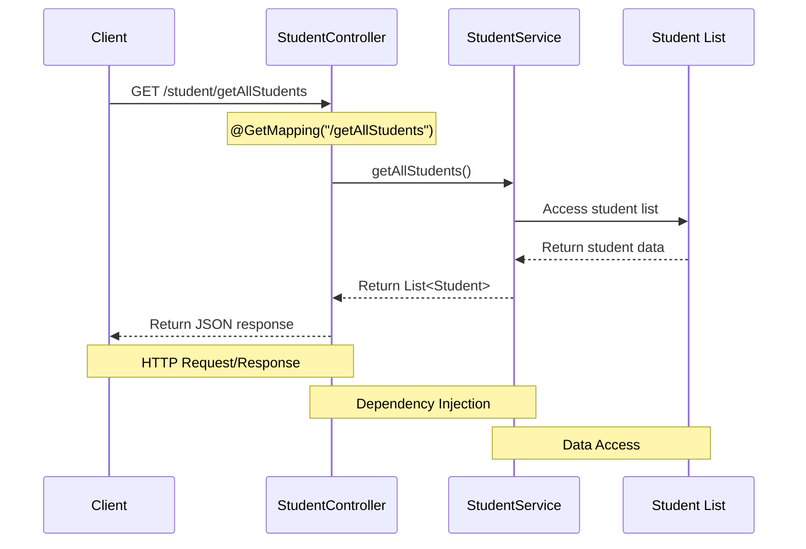

<div dir="rtl">

## מבנה 

אפליקציית Spring Boot מאורגנת בארכיטקטורת שכבות ברורה, המופרדת לתתי-חבילות:

- **model**: מכיל את מחלקת `Student` המייצגת את מודל הנתונים
- **service**: מכיל את `StudentService` המטפל בלוגיקה העסקית
- **controller**: מכיל את `StudentController` המטפל בבקשות HTTP

ארגון זה מיישם את עקרון ההפרדה בין רכיבים (Separation of Concerns), שמקל על תחזוקה, הרחבה ובדיקה של היישום.

## קוד האפליקציה

### StudentController.java

</div>

```java
package org.example.stage3.controller;

import org.example.stage3.model.Student;
import org.example.stage3.service.StudentService;
import org.springframework.web.bind.annotation.GetMapping;
import org.springframework.web.bind.annotation.RequestMapping;
import org.springframework.web.bind.annotation.RestController;

import java.util.List;

@RestController
@RequestMapping("/student")
public class StudentController {

   private final StudentService studentService;

   public StudentController(StudentService studentService) {
      this.studentService = studentService;
   }

   @GetMapping("/getAllStudents")
   public List<Student> getAllStudents() {
      return studentService.getAllStudents();
   }
}
```

<div dir="rtl">

### Student.java

</div>

```java
package org.example.stage3.model;

/*
 * This class is a model class that represents a student entity.
 * It has four fields: id, firstName, lastName, and age.
 * It has a constructor that initializes all the fields.
 *
 * in future stages, we will use lombok to generate getters, setters, and toString methods.
 * it is a good practice to use lombok to avoid boilerplate code.
 */
public class Student {
    Long id;
    String firstName;
    String lastName;
    double age;

    public Student() {
    }

    public Student(Long id, String firstName, String lastName, double age) {
        this.id = id;
        this.firstName = firstName;
        this.lastName = lastName;
        this.age = age;
    }

    public Long getId() {
        return id;
    }

    public void setId(Long id) {
        this.id = id;
    }

    public String getFirstName() {
        return firstName;
    }

    public void setFirstName(String firstName) {
        this.firstName = firstName;
    }

    public String getLastName() {
        return lastName;
    }

    public void setLastName(String lastName) {
        this.lastName = lastName;
    }

    public double getAge() {
        return age;
    }

    public void setAge(double age) {
        this.age = age;
    }

    @Override
    public String toString() {
        return "Student{" +
                "id=" + id +
                ", firstName='" + firstName + '\'' +
                ", lastName='" + lastName + '\'' +
                ", age=" + age +
                '}';
    }
}
```

<div dir="rtl">

### StudentService.java

</div>

```java
package org.example.stage3.service;

import org.example.stage3.model.Student;
import org.springframework.stereotype.Service;

import java.util.ArrayList;
import java.util.Arrays;
import java.util.List;

@Service
public class StudentService {

    List<Student> students = new ArrayList<>(Arrays.asList(
        new Student(1L, "Alice", "Moskovitz", 21.3),
        new Student(2L, "Bob", "Smith", 22.3),
        new Student(3L, "Charlie", "Brown", 23.3),
        new Student(4L, "David", "Miller", 24.3)
    ));

    public List<Student> getAllStudents() {
        return students;
    }
}
```

<div dir="rtl">

## ארכיטקטורת האפליקציה

</div>



<div dir="rtl">

## זרימת בקשה במערכת

</div>



<div dir="rtl">

## בדיקת האפליקציה

קיימות מספר דרכים לבדוק את האפליקציה:

### 1. שימוש ב-HTTP Client של IntelliJ Ultimate

IntelliJ Ultimate מכיל כלי מובנה לביצוע בקשות HTTP:

1. יצירת קובץ `.http` או `.rest` בפרויקט
2. כתיבת בקשה בסיסית:

</div>

```http
GET http://localhost:8080/student/getAllStudents
Accept: application/json
```

<div dir="rtl">

3. לחיצה על האייקון "Run" ליד הבקשה

יתרונות:
- משולב בסביבת הפיתוח
- תמיכה בתחביר ב-IDE
- שמירת היסטוריית תגובות
- אפשרות לכתוב סקריפטים של בקשות

שימושים מתקדמים:

</div>

```http
### קבלת כל הסטודנטים
GET http://localhost:8080/student/getAllStudents

### בדיקה בסביבה אחרת (לדוגמה)
GET {{host}}/student/getAllStudents
Accept: application/json

### הגדרת משתנים סביבתיים (אפשרי ליצור ולבחור סביבות שונות)
@host = http://localhost:8080
```

<div dir="rtl">

### 2. שימוש בדפדפן

לבקשות GET פשוטות:
1. פתיחת דפדפן
2. ניווט ל-`http://localhost:8080/student/getAllStudents`

יתרונות:
- פשטות
- גישה מהירה לבקשות GET
- תצוגה ידידותית של JSON (בדפדפנים מודרניים)

מגבלות:
- מוגבל בעיקר לבקשות GET
- פחות נוח עבור פרמטרים מורכבים

### 3. שימוש ב-Postman

Postman הוא כלי עוצמתי לבדיקת API:

1. התקנת Postman
2. יצירת בקשה חדשה:
    - בחירת סוג הבקשה (GET)
    - הזנת URL: `http://localhost:8080/student/getAllStudents`
    - לחיצה על "Send"

יתרונות:
- תמיכה בכל סוגי הבקשות (GET, POST, PUT, DELETE וכו')
- ממשק גרפי ידידותי
- אפשרות לשמור בקשות באוספים
- ניתן ליצור סביבות עבודה שונות (פיתוח, בדיקות, ייצור)

## הגדרת לוגים מפורטים

הוספת הגדרה ל-`application.properties`:

</div>

```properties
logging.level.org.springframework.web=DEBUG
```

<div dir="rtl">

יתרונות הלוגים המפורטים:
- הצגת מידע מפורט על בקשות HTTP הנכנסות
- הצגת מסלול הניתוב של הבקשה
- מידע על הפרמטרים שהתקבלו
- מעקב אחרי תהליך המרת התגובה
- שימושי לפתרון בעיות וניפוי שגיאות

דוגמה לפלט לוגים:

</div>

```
2025-03-16 10:15:23.456 DEBUG 12345 --- [nio-8080-exec-1] o.s.web.servlet.DispatcherServlet        : GET "/student/getAllStudents", parameters={}
2025-03-16 10:15:23.458 DEBUG 12345 --- [nio-8080-exec-1] s.w.s.m.m.a.RequestMappingHandlerMapping : Mapped to org.example.stage3.controller.StudentController#getAllStudents()
2025-03-16 10:15:23.460 DEBUG 12345 --- [nio-8080-exec-1] m.m.a.RequestResponseBodyMethodProcessor : Using 'application/json', given [*/*] and supported [application/json]
2025-03-16 10:15:23.461 DEBUG 12345 --- [nio-8080-exec-1] m.m.a.RequestResponseBodyMethodProcessor : Writing [[Student{id=1, firstName='Alice', lastName='Moskovitz', age=21.3}, Student{id=2, firstName='Bob', (truncated)...]
2025-03-16 10:15:23.463 DEBUG 12345 --- [nio-8080-exec-1] o.s.web.servlet.DispatcherServlet        : Completed 200 OK
```

<div dir="rtl">

## הזרקת תלויות (Dependency Injection)

האפליקציה משתמשת בהזרקת תלויות, אחד מעקרונות היסוד של Spring:

</div>

```java
private final StudentService studentService;

public StudentController(StudentService studentService) {
    this.studentService = studentService;
}
```

<div dir="rtl">

### יתרונות הזרקת תלויות:

1. **צימוד חלש (Loose Coupling)**:
    - הרכיבים אינם יוצרים ישירות את התלויות שלהם
    - רכיבים תלויים בהפשטות (interfaces) ולא במימושים ספציפיים

2. **יכולת בדיקה (Testability)**:
    - קל יותר ליצור בדיקות יחידה
    - אפשר להחליף תלויות אמיתיות ב-mocks או stubs

3. **מודולריות**:
    - קל להחליף מימושים של שירותים
    - התאמה לתרחישים שונים ללא שינוי בקוד הלקוח

4. **ניהול מחזור חיים**:
    - Spring מנהל את מחזור החיים של ה-beans
    - יכולת לנהל היקף (scope) - singleton, prototype, request, session

5. **פחות קוד boilerplate**:
    - אין צורך בקוד אתחול מורכב
    - Spring מטפל ביצירת האובייקטים וקישור התלויות

### אופן היישום ב-Spring Boot:

- **אנוטציית `@Service`**: מסמנת את `StudentService` כ-bean של שירות
- **אנוטציית `@RestController`**: מסמנת את `StudentController` כ-bean של בקר REST
- **הזרקה בבנאי**: Spring מזריק אוטומטית את ה-bean המתאים בזמן יצירת הבקר

Spring מסתמך על הקונבנציה שמימוש אחד יהיה זמין לכל תלות, או שתהיה אנוטציה המציינת איזה מימוש יש להזריק כאשר יש מספר אפשרויות.

## איך הכל מתחבר?

</div>

```
HTTP Request → Controller → Service → Model → JSON Response
     ↑                                             ↓
     └─────────────── HTTP Response ──────────────┘
```

<div dir="rtl">

כשמגיעה בקשת HTTP ל-`/student/getAllStudents`:

1. Spring מנתב את הבקשה ל-`StudentController.getAllStudents()`
2. הבקר משתמש ב-`StudentService` (שהוזרק אליו) כדי לקבל את הנתונים
3. השירות מחזיר רשימת אובייקטי `Student`
4. Spring ממיר אוטומטית את רשימת האובייקטים ל-JSON
5. התגובה נשלחת חזרה ללקוח

הודות להזרקת התלויות, כל רכיב מתמקד בתפקידו בלבד:
- בקר: טיפול בבקשות HTTP
- שירות: לוגיקה עסקית
- מודל: מבנה הנתונים

</div>