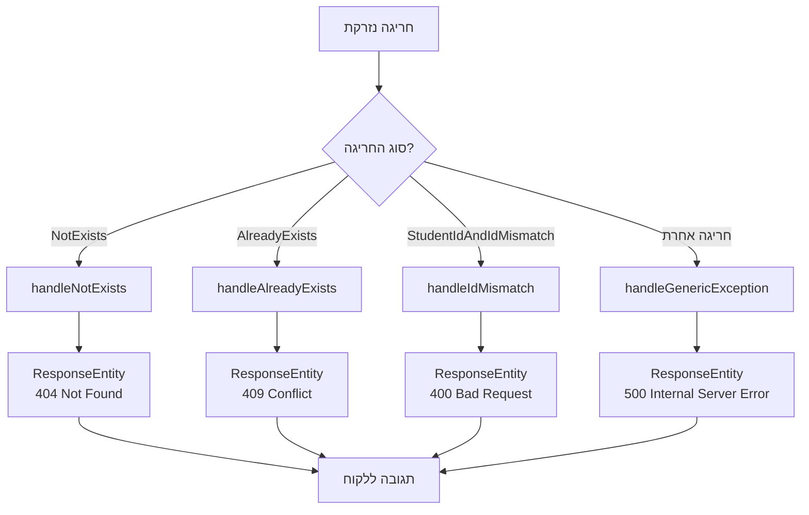

<div dir="rtl">

# מנגנון טיפול בחריגות ב-Spring Boot


## מבוא

טיפול בשגיאות הוא חלק קריטי מכל אפליקציה מקצועית. ב-Spring Boot, קיים מנגנון מתקדם לטיפול בחריגות (Exceptions) שמאפשר לייצר תגובות שגיאה עקביות ומובנות.

המנגנון שהוטמע בפרויקט שלנו כולל:
1. חריגות מותאמות אישית (Custom Exceptions)
2. מטפל חריגות גלובלי (Global Exception Handler)
3. מחלקה אחידה לתגובות שגיאה (Error Response)

## הזרימה של טיפול בשגיאות

```mermaid
sequenceDiagram
    participant Client
    participant Controller
    participant Service
    participant ExHandler as Global Exception Handler
    
    Client->>Controller: בקשת HTTP
    
    rect rgb(20, 20, 20)
    note right of Controller: מקרה 1: משאב לא נמצא
    Controller->>Service: קריאה לשירות
    Service--xController: זריקת NotExists
    Controller--xExHandler: העברת NotExists
    ExHandler-->>Client: תגובת שגיאה 404 Not Found
    end
    
    rect rgb(40, 40, 40)
    note right of Controller: מקרה 2: משאב כבר קיים
    Controller->>Service: קריאה לשירות
    Service--xController: זריקת AlreadyExists
    Controller--xExHandler: העברת AlreadyExists
    ExHandler-->>Client: תגובת שגיאה 409 Conflict
    end
    
    rect rgb(60, 60, 60)
    note right of Controller: מקרה 3: אי התאמה בזיהוי
    Controller->>Service: קריאה לשירות
    Service--xController: זריקת StudentIdAndIdMismatch
    Controller--xExHandler: העברת StudentIdAndIdMismatch
    ExHandler-->>Client: תגובת שגיאה 400 Bad Request
    end
    
    rect rgb(80, 80, 80)
    note right of Controller: מקרה 4: שגיאה כללית
    Controller->>Service: קריאה לשירות
    Service--xController: זריקת Exception אחרת
    Controller--xExHandler: העברת Exception
    ExHandler-->>Client: תגובת שגיאה 500 Internal Server Error
    end
```



## רכיבי מערכת הטיפול בחריגות

### 1. חריגות מותאמות אישית

יצרנו מספר מחלקות חריגה מותאמות אישית לטיפול במקרים שונים:

</div>

```java
// NotExists.java
package org.example.stage5_1.exception;

public class NotExists extends RuntimeException {
    public NotExists(String message) {
        super(message);
    }
}
```

```java
// AlreadyExists.java
package org.example.stage5_1.exception;

public class AlreadyExists extends RuntimeException {
    public AlreadyExists(String message) {
        super(message);
    }
}
```

```java
// StudentIdAndIdMismatch.java
package org.example.stage5_1.exception;

public class StudentIdAndIdMismatch extends RuntimeException{
    public StudentIdAndIdMismatch(String message) {
        super(message);
    }
}
```

<div dir="rtl">

**יתרונות של חריגות מותאמות אישית**:
- מאפשרות טיפול ספציפי לכל סוג שגיאה
- מגבירות את קריאות הקוד (ברור מה השגיאה)
- מקלות על יצירת תגובות HTTP מתאימות

### 2. מחלקת תגובת שגיאה

מחלקה זו מספקת מבנה אחיד לכל תגובות השגיאה:

</div>

```java
// ErrorResponse.java
package org.example.stage5_1.model;

import lombok.Data;

import java.time.LocalDateTime;


/*
 This is used mostly for error handling in the controller.
 If error occurs, this class will be used to return the error message to the client.
 */
@Data
public class ErrorResponse {
    private String error;
    private String message;
    private LocalDateTime timestamp;

    public ErrorResponse(String error, String message) {
        this.error = error;
        this.message = message;
        this.timestamp = LocalDateTime.now();
    }
}
```

<div dir="rtl">

**יתרונות של מבנה תגובה אחיד**:
- קל לצרכני ה-API להתמודד עם שגיאות
- כולל מידע שימושי (סוג השגיאה, הודעה, זמן התרחשות)
- שומר על עקביות בממשק המשתמש

### 3. מטפל חריגות גלובלי

זהו הרכיב המרכזי שאחראי על תפיסת החריגות והמרתן לתגובות HTTP. הוא מופעל אוטומטית על ידי Spring כאשר נזרקת חריגה:

</div>

```java
// GlobalExceptionHandler.java
package org.example.stage5_1.exception;

import org.example.stage5_1.model.ErrorResponse;
import org.springframework.http.HttpStatus;
import org.springframework.http.ResponseEntity;
import org.springframework.web.bind.annotation.ControllerAdvice;
import org.springframework.web.bind.annotation.ExceptionHandler;

/**
 * GlobalExceptionHandler, this class is used to handle exceptions globally
 * instead of handling them in each controller separately.
 */
@ControllerAdvice
public class GlobalExceptionHandler {

    /**
     * takes care of the exception when a resource is not found, 404 Not Found
     */
    @ExceptionHandler(NotExists.class)
    public ResponseEntity<Object> handleNotExists(NotExists ex) {
        return ResponseEntity
                .status(HttpStatus.NOT_FOUND)
                .body(new ErrorResponse("Resource Not Found", ex.getMessage()));
    }

    /**
     * takes care of the exception when a resource already exists, 409 Conflict
     * This is more appropriate than 400 Bad Request when trying to create a resource with an ID that already exists
     */
    @ExceptionHandler(AlreadyExists.class)
    public ResponseEntity<Object> handleAlreadyExists(AlreadyExists ex) {
        return ResponseEntity
                .status(HttpStatus.CONFLICT)
                .body(new ErrorResponse("Resource Conflict", ex.getMessage()));
    }

    /**
     * takes care of the exception when there's an ID mismatch, 400 Bad Request
     */
    @ExceptionHandler(StudentIdAndIdMismatch.class)
    public ResponseEntity<Object> handleIdMismatch(StudentIdAndIdMismatch ex) {
        return ResponseEntity
                .status(HttpStatus.BAD_REQUEST)
                .body(new ErrorResponse("ID Mismatch", ex.getMessage()));
    }

    /**
     * takes care of general exceptions, 500 Internal Server Error
     */
    @ExceptionHandler(Exception.class)
    public ResponseEntity<Object> handleGenericException(Exception ex) {
        return ResponseEntity
                .status(HttpStatus.INTERNAL_SERVER_ERROR)
                .body(new ErrorResponse("Internal Server Error", ex.getMessage()));
    }
}
```

<div dir="rtl">

## איך זה עובד? הסבר מפורט

### 1. הפעלת המנגנון - אנוטציית `@ControllerAdvice`

האנוטציה `@ControllerAdvice` מסמנת את המחלקה כמטפל גלובלי בחריגות. Spring יפעיל את המחלקה הזו כל פעם שתיזרק חריגה בתהליך הטיפול בבקשת HTTP בכל הבקרים באפליקציה.

### 2. הגדרת מטפלי חריגה ספציפיים - אנוטציית `@ExceptionHandler`

כל מתודה במחלקת ה-`GlobalExceptionHandler` שמסומנת באנוטציה `@ExceptionHandler` מגדירה איזה סוג חריגה היא מטפלת בו. למשל:

- `@ExceptionHandler(NotExists.class)` - מטפלת בחריגות מסוג `NotExists`
- `@ExceptionHandler(AlreadyExists.class)` - מטפלת בחריגות מסוג `AlreadyExists`
- `@ExceptionHandler(Exception.class)` - רשת ביטחון שתופסת כל חריגה אחרת

### 3. סדר מטפלי החריגה

Spring ינסה למצוא את המטפל הספציפי ביותר לחריגה שנזרקה. למשל:
- אם נזרקה `NotExists`, המתודה `handleNotExists` תטפל בה
- אם נזרקה `AlreadyExists`, המתודה `handleAlreadyExists` תטפל בה
- אם נזרקה חריגה שאין לה מטפל ספציפי, המתודה `handleGenericException` תטפל בה כמוצא אחרון

זה מתואר בתרשים הזרימה הבא:

</div>



<div dir="rtl">

### 4. קודי סטטוס HTTP ושימושם

מערכת הטיפול בחריגות משתמשת בקודי סטטוס HTTP שונים בהתאם לסוג השגיאה:

- **400 Bad Request**: קלט לא תקין (כמו אי התאמה בין מזהים)
- **404 Not Found**: משאב מבוקש לא נמצא
- **409 Conflict**: ניסיון ליצור משאב עם מזהה שכבר קיים
- **500 Internal Server Error**: שגיאות כלליות או לא צפויות

הקוד 409 Conflict מתאים במיוחד למקרים בהם יש התנגשות עם המצב הנוכחי של המערכת, כמו ניסיון להוסיף סטודנט עם ID שכבר קיים.

### 5. יצירת תגובות HTTP מתאימות

כל מתודת טיפול מייצרת אובייקט `ResponseEntity` שכולל:
- קוד סטטוס HTTP מתאים (400, 404, 409, 500 וכו')
- אובייקט `ErrorResponse` שמכיל את פרטי השגיאה

### 6. דוגמאות לזריקת חריגות בשירות

השירות יכול לזרוק חריגות במקרים שונים:

</div>

```java
// StudentServiceImpl.java (חלק)
package org.example.stage5_1.service;

import org.example.stage5_1.exception.AlreadyExists;
import org.example.stage5_1.exception.NotExists;
import org.example.stage5_1.exception.StudentIdAndIdMismatch;
import org.example.stage5_1.model.Student;
import org.springframework.stereotype.Service;

import java.util.ArrayList;
import java.util.Arrays;
import java.util.List;

@Service
public class StudentServiceImpl implements StudentService {

    List<Student> students = new ArrayList<>(Arrays.asList(
        new Student(1L, "Alice", "Moskovitz", 21.3),
        new Student(2L, "Bob", "Smith", 22.3),
        new Student(3L, "Charlie", "Brown", 23.3),
        new Student(4L, "David", "Miller", 24.3)
    ));

    public List<Student> getAllStudents() {
        return students;
    }

    public Student addStudent(Student student) {
        if (students.stream().anyMatch(s -> s.getId().equals(student.getId()))) {
            // now the exception is thrown, and will be handled in the ControllerAdvice GlobalExceptionHandler
            throw new AlreadyExists("Student with id " + student.getId() + " already exists");
        }
        students.add(student);
        return student;
    }

    public Student updateStudent(Student student, Long id) {
        // Check if the ID parameter matches the student's ID
        if (!student.getId().equals(id)) {
            // Exception is thrown and will be handled in the ControllerAdvice GlobalExceptionHandler
            throw new StudentIdAndIdMismatch("Student with id " + id + " mismatch with body id " + student.getId());
        }

        // Use Stream API to find and update the student in one operation
        return students.stream()
                .filter(s -> s.getId().equals(id))
                .findFirst()
                .map(existingStudent -> {
                    existingStudent.setFirstName(student.getFirstName());
                    existingStudent.setLastName(student.getLastName());
                    existingStudent.setAge(student.getAge());
                    return existingStudent;
                })
                .orElseThrow(() -> new NotExists("Student with id " + id + " does not exist"));
    }

    public void deleteStudent(Long id) {
        // check if a student exists
        if (students.stream().noneMatch(s -> s.getId().equals(id))) {
            // now the exception is thrown, and will be handled in the ControllerAdvice GlobalExceptionHandler
            throw new NotExists ("Student with id " + id + " does not exist");
        }
        students.removeIf(s -> s.getId().equals(id));
    }
}
```

<div dir="rtl">

## הבקר - עכשיו נקי מטיפול בחריגות

בקר ה-REST בגישה זו נשאר נקי ופשוט, מאחר שכל טיפול השגיאות עבר למנגנון הגלובלי:

</div>

```java
// StudentController.java
package org.example.stage5_1.controller;

import org.example.stage5_1.model.Student;
import org.example.stage5_1.service.StudentService;
import org.example.stage5_1.service.StudentServiceImpl;
import org.springframework.http.ResponseEntity;
import org.springframework.web.bind.annotation.*;
import org.springframework.web.servlet.support.ServletUriComponentsBuilder;

import java.net.URI;
import java.util.List;

@RestController
@RequestMapping("/students")
public class StudentController {

    private final StudentService studentServiceImpl;

    public StudentController(StudentServiceImpl studentServiceImpl) {
        this.studentServiceImpl = studentServiceImpl;
    }

    @GetMapping()
    public ResponseEntity<List<Student>> getAllStudents() {
        List<Student> studentList = studentServiceImpl.getAllStudents();
        return ResponseEntity.ok(studentList); // 200 OK
    }

    @PostMapping()
    public ResponseEntity<Student> addStudent(@RequestBody Student student) {
        Student added = studentServiceImpl.addStudent(student);

        URI location = ServletUriComponentsBuilder
                .fromCurrentRequest()
                .path("/{id}")
                .buildAndExpand(added.getId())
                .toUri();

        return ResponseEntity.created(location).body(added); // 201 Created
    }

    @PutMapping("/{id}")
    public ResponseEntity<Student> updateStudent(@RequestBody Student student, @PathVariable Long id) {
        Student updated = studentServiceImpl.updateStudent(student, id);
        return ResponseEntity.ok(updated); // 200 OK
    }

    @DeleteMapping("/{id}")
    public ResponseEntity<Void> deleteStudent(@PathVariable Long id) {
        studentServiceImpl.deleteStudent(id);
        return ResponseEntity.noContent().build(); // 204 No Content
    }
}
```

<div dir="rtl">

## מחלקות תומכות נוספות

### ממשק השירות

</div>

```java
// StudentService.java
package org.example.stage5_1.service;

import org.example.stage5_1.model.Student;

import java.util.List;

public interface StudentService {

    List<Student> getAllStudents();
    Student addStudent(Student student);
    Student updateStudent(Student student, Long id);
    void deleteStudent(Long id);
}
```

<div dir="rtl">

### מחלקת המודל - Student

</div>

```java
// Student.java
package org.example.stage5_1.model;


import lombok.AllArgsConstructor;
import lombok.Data;
import lombok.NoArgsConstructor;
import lombok.ToString;

/*
   Lombok, boilerplate code reduction library, is used to generate the getters, setters, equals, hashcode, and toString methods.
 */
@Data
@NoArgsConstructor
@AllArgsConstructor
@ToString
public class Student {
    Long id;
    String firstName;
    String lastName;
    double age;
}
```

<div dir="rtl">

## דוגמאות לתגובות שגיאה

### 1. משאב לא נמצא (404 Not Found)

</div>

```json
{
  "error": "Resource Not Found",
  "message": "Student with id 100 does not exist",
  "timestamp": "2025-03-16T14:33:12.456"
}
```

<div dir="rtl">

### 2. משאב כבר קיים (409 Conflict)

</div>

```json
{
  "error": "Resource Conflict",
  "message": "Student with id 1 already exists",
  "timestamp": "2025-03-16T14:33:50.789"
}
```

<div dir="rtl">

### 3. שגיאה פנימית (500 Internal Server Error)

</div>

```json
{
  "error": "Internal Server Error",
  "message": "An unexpected error occurred while processing your request",
  "timestamp": "2025-03-16T14:34:01.789"
}
```

<div dir="rtl">

## יתרונות המערכת

1. **הפרדת אחריות** - הקוד העסקי של הבקרים והשירותים נשאר נקי מלוגיקת טיפול בשגיאות
2. **עקביות** - כל השגיאות מטופלות בצורה אחידה ומחזירות תגובות במבנה זהה
3. **תחזוקתיות** - קל להוסיף או לשנות את הטיפול בסוגי שגיאות חדשים
4. **קודי סטטוס מדויקים** - כל סוג שגיאה מקבל קוד סטטוס HTTP מתאים (404 למשאב לא קיים, 409 להתנגשות, וכו')
5. **חווית משתמש טובה יותר** - הלקוח מקבל הודעות שגיאה ברורות וקודי סטטוס מתאימים

מערכת הטיפול בחריגות ב-Spring Boot מספקת דרך אלגנטית ויעילה לטפל בשגיאות באפליקציית REST API:

1. החריגות נזרקות במקום המתאים (בקר או שירות)
2. מטפל החריגות הגלובלי תופס את החריגות ומתרגם אותן לתגובות HTTP מתאימות
3. המשתמש מקבל הודעות שגיאה עקביות וקודי סטטוס מדויקים

המערכת שיישמנו מדגימה את העיקרון של "הפרדת אחריות" - הקוד העסקי מתמקד בלוגיקה, והטיפול בשגיאות מרוכז במקום אחד. בנוסף, השימוש בקוד 409 Conflict לניהול התנגשויות משאבים משפר את הדיוק והבהירות של ה-API.

</div>