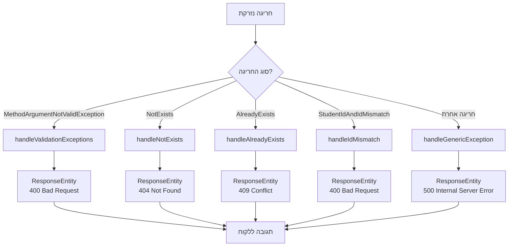

<div dir="rtl">

# מנגנון טיפול בחריגות ב-Spring Boot


## מבוא

טיפול בשגיאות הוא חלק קריטי מכל אפליקציה מקצועית. ב-Spring Boot, קיים מנגנון מתקדם לטיפול בחריגות (Exceptions) שמאפשר לייצר תגובות שגיאה עקביות ומובנות.

המנגנון שהוטמע בפרויקט שלנו כולל:
1. חריגות מותאמות אישית (Custom Exceptions)
2. מטפל חריגות גלובלי (Global Exception Handler)
3. מחלקה אחידה לתגובות שגיאה (Error Response)

## הזרימה של טיפול בשגיאות

```mermaid
sequenceDiagram
    participant Client
    participant Controller
    participant Service
    participant ExHandler as Global Exception Handler
    
    Client->>Controller: בקשת HTTP
    
    rect rgb(0, 0, 0)
    note right of Controller: מקרה 1: שגיאת ולידציה
    Controller->>Controller: בדיקת ולידציה של הקלט (@Valid)
    Controller--xExHandler: MethodArgumentNotValidException
    ExHandler-->>Client: תגובת שגיאה 400 Bad Request
    end
    
    rect rgb(20, 20, 20)
    note right of Controller: מקרה 2: משאב לא נמצא
    Controller->>Service: קריאה לשירות
    Service--xController: זריקת NotExists
    Controller--xExHandler: העברת NotExists
    ExHandler-->>Client: תגובת שגיאה 404 Not Found
    end
    
    rect rgb(40, 40, 40)
    note right of Controller: מקרה 3: משאב כבר קיים
    Controller->>Service: קריאה לשירות
    Service--xController: זריקת AlreadyExists
    Controller--xExHandler: העברת AlreadyExists
    ExHandler-->>Client: תגובת שגיאה 409 Conflict
    end
    
    rect rgb(60, 60, 60)
    note right of Controller: מקרה 4: אי התאמה בזיהוי
    Controller->>Service: קריאה לשירות
    Service--xController: זריקת StudentIdAndIdMismatch
    Controller--xExHandler: העברת StudentIdAndIdMismatch
    ExHandler-->>Client: תגובת שגיאה 400 Bad Request
    end
    
    rect rgb(80, 80, 80)
    note right of Controller: מקרה 5: שגיאה כללית
    Controller->>Service: קריאה לשירות
    Service--xController: זריקת Exception אחרת
    Controller--xExHandler: העברת Exception
    ExHandler-->>Client: תגובת שגיאה 500 Internal Server Error
    end
```

</div>



<div dir="rtl">

## רכיבי מערכת הטיפול בחריגות

### 1. חריגות מותאמות אישית

יצרנו מספר מחלקות חריגה מותאמות אישית לטיפול במקרים שונים:

</div>

```java
package org.example.stage5_2.exception;

public class NotExists extends RuntimeException {
    public NotExists(String message) {
        super(message);
    }
}

public class AlreadyExists extends RuntimeException {
    public AlreadyExists(String message) {
        super(message);
    }
}

public class StudentIdAndIdMismatch extends RuntimeException {
    public StudentIdAndIdMismatch(String message) {
        super(message);
    }
}
```

<div dir="rtl">

**יתרונות של חריגות מותאמות אישית**:
- מאפשרות טיפול ספציפי לכל סוג שגיאה
- מגבירות את קריאות הקוד (ברור מה השגיאה)
- מקלות על יצירת תגובות HTTP מתאימות

### 2. מחלקת תגובת שגיאה

מחלקה זו מספקת מבנה אחיד לכל תגובות השגיאה:

</div>

```java
package org.example.stage5_2.model;

import lombok.Data;
import java.time.LocalDateTime;

@Data
public class ErrorResponse {
    private String error;
    private String message;
    private LocalDateTime timestamp;

    public ErrorResponse(String error, String message) {
        this.error = error;
        this.message = message;
        this.timestamp = LocalDateTime.now();
    }
}
```

<div dir="rtl">

**יתרונות של מבנה תגובה אחיד**:
- קל לצרכני ה-API להתמודד עם שגיאות
- כולל מידע שימושי (סוג השגיאה, הודעה, זמן התרחשות)
- שומר על עקביות בממשק המשתמש

### 3. מטפל חריגות גלובלי

זהו הרכיב המרכזי שאחראי על תפיסת החריגות והמרתן לתגובות HTTP. הוא מופעל אוטומטית על ידי Spring כאשר נזרקת חריגה:

</div>

```java
package org.example.stage5_2.exception;

import org.example.stage5_2.model.ErrorResponse;
import org.springframework.http.HttpStatus;
import org.springframework.http.ResponseEntity;
import org.springframework.web.bind.MethodArgumentNotValidException;
import org.springframework.web.bind.annotation.ControllerAdvice;
import org.springframework.web.bind.annotation.ExceptionHandler;

import java.util.HashMap;
import java.util.Map;

@ControllerAdvice
public class GlobalExceptionHandler {

    @ExceptionHandler(NotExists.class)
    public ResponseEntity<Object> handleNotExists(NotExists ex) {
        return ResponseEntity
                .status(HttpStatus.NOT_FOUND)
                .body(new ErrorResponse("Resource Not Found", ex.getMessage()));
    }

    @ExceptionHandler(AlreadyExists.class)
    public ResponseEntity<Object> handleAlreadyExists(AlreadyExists ex) {
        return ResponseEntity
                .status(HttpStatus.CONFLICT)
                .body(new ErrorResponse("Resource Conflict", ex.getMessage()));
    }

    @ExceptionHandler(StudentIdAndIdMismatch.class)
    public ResponseEntity<Object> handleIdMismatch(StudentIdAndIdMismatch ex) {
        return ResponseEntity
                .status(HttpStatus.BAD_REQUEST)
                .body(new ErrorResponse("ID Mismatch", ex.getMessage()));
    }

    @ExceptionHandler(Exception.class)
    public ResponseEntity<Object> handleGenericException(Exception ex) {
        return ResponseEntity
                .status(HttpStatus.INTERNAL_SERVER_ERROR)
                .body(new ErrorResponse("Internal Server Error", ex.getMessage()));
    }

    @ExceptionHandler(MethodArgumentNotValidException.class)
    public ResponseEntity<ErrorResponse> handleValidationExceptions(MethodArgumentNotValidException ex) {
        Map<String, String> errors = new HashMap<>();

        ex.getBindingResult().getFieldErrors().forEach(error ->
                errors.put(error.getField(), error.getDefaultMessage())
        );

        ErrorResponse errorResponse = new ErrorResponse(
                "Validation Failed",
                errors.toString()
        );

        return ResponseEntity.badRequest().body(errorResponse);
    }
}
```

<div dir="rtl">

## איך זה עובד? הסבר מפורט

### 1. הפעלת המנגנון - אנוטציית `@ControllerAdvice`

האנוטציה `@ControllerAdvice` מסמנת את המחלקה כמטפל גלובלי בחריגות. Spring יפעיל את המחלקה הזו כל פעם שתיזרק חריגה בתהליך הטיפול בבקשת HTTP בכל הבקרים באפליקציה.

### 2. הגדרת מטפלי חריגה ספציפיים - אנוטציית `@ExceptionHandler`

כל מתודה במחלקת ה-`GlobalExceptionHandler` שמסומנת באנוטציה `@ExceptionHandler` מגדירה איזה סוג חריגה היא מטפלת בו. למשל:

- `@ExceptionHandler(NotExists.class)` - מטפלת בחריגות מסוג `NotExists`
- `@ExceptionHandler(AlreadyExists.class)` - מטפלת בחריגות מסוג `AlreadyExists`
- `@ExceptionHandler(Exception.class)` - רשת ביטחון שתופסת כל חריגה אחרת

### 3. סדר מטפלי החריגה

Spring ינסה למצוא את המטפל הספציפי ביותר לחריגה שנזרקה. למשל:
- אם נזרקה `NotExists`, המתודה `handleNotExists` תטפל בה
- אם נזרקה `AlreadyExists`, המתודה `handleAlreadyExists` תטפל בה
- אם נזרקה חריגה שאין לה מטפל ספציפי, המתודה `handleGenericException` תטפל בה כמוצא אחרון

זה מתואר בתרשים הזרימה הבא:

</div>



<div dir="rtl">

### 4. קודי סטטוס HTTP ושימושם

מערכת הטיפול בחריגות משתמשת בקודי סטטוס HTTP שונים בהתאם לסוג השגיאה:

- **400 Bad Request**: שגיאות ולידציה וקלט לא תקין (כמו אי התאמה בין מזהים)
- **404 Not Found**: משאב מבוקש לא נמצא
- **409 Conflict**: ניסיון ליצור משאב עם מזהה שכבר קיים
- **500 Internal Server Error**: שגיאות כלליות או לא צפויות

הקוד 409 Conflict מתאים במיוחד למקרים בהם יש התנגשות עם המצב הנוכחי של המערכת, כמו ניסיון להוסיף סטודנט עם ID שכבר קיים.

### 5. יצירת תגובות HTTP מתאימות

כל מתודת טיפול מייצרת אובייקט `ResponseEntity` שכולל:
- קוד סטטוס HTTP מתאים (400, 404, 409, 500 וכו')
- אובייקט `ErrorResponse` שמכיל את פרטי השגיאה

### 6. דוגמאות לזריקת חריגות בשירות

השירות יכול לזרוק חריגות במקרים שונים:

</div>

```java
public Student addStudent(Student student) {
    if (students.stream().anyMatch(s -> s.getId().equals(student.getId()))) {
        // now the exception is thrown, and will be handled in the ControllerAdvice GlobalExceptionHandler
        throw new AlreadyExists("Student with id " + student.getId() + " already exists");
    }
    students.add(student);
    return student;
}

public Student updateStudent(Student student, Long id) {
    // check if a student exists
    if (students.stream().noneMatch(s -> s.getId().equals(id))) {
        // now the exception is thrown, and will be handled in the ControllerAdvice GlobalExceptionHandler
        throw new NotExists("Student with id " + student.getId() + " does not exist");
    }
    if (!student.getId().equals(id)) {
        // now the exception is thrown, and will be handled in the ControllerAdvice GlobalExceptionHandler
        throw new StudentIdAndIdMismatch("Student with id " + id + " mismatch with body id " + student.getId());
    }
    // המשך הקוד...
}
```

<div dir="rtl">

## דוגמאות לתגובות שגיאה

### 1. שגיאת ולידציה (400 Bad Request)

</div>

```json
{
  "error": "Validation Failed",
  "message": "{firstName=First name must be between 2 and 50 characters, age=Age must be a positive number}",
  "timestamp": "2025-03-16T14:32:45.123"
}
```

<div dir="rtl">

### 2. משאב לא נמצא (404 Not Found)

</div>

```json
{
  "error": "Resource Not Found",
  "message": "Student with id 100 does not exist",
  "timestamp": "2025-03-16T14:33:12.456"
}
```

<div dir="rtl">

### 3. משאב כבר קיים (409 Conflict)

</div>

```json
{
  "error": "Resource Conflict",
  "message": "Student with id 1 already exists",
  "timestamp": "2025-03-16T14:33:50.789"
}
```

<div dir="rtl">

### 4. שגיאה פנימית (500 Internal Server Error)

</div>

```json
{
  "error": "Internal Server Error",
  "message": "An unexpected error occurred while processing your request",
  "timestamp": "2025-03-16T14:34:01.789"
}
```

<div dir="rtl">

## שגיאות ולידציה מיוחדות

שגיאות ולידציה מטופלות בצורה מיוחדת. כאשר נעשה שימוש באנוטציה `@Valid` לפני פרמטר בבקר, Spring יבצע ולידציה אוטומטית לפי האנוטציות שהוגדרו במודל:

</div>

```java
@PostMapping("/addStudent")
public ResponseEntity<Student> addStudent(@Valid @RequestBody Student student) {
    // הקוד יגיע לכאן רק אם הולידציה עברה בהצלחה
    Student added = studentService.addStudent(student);
    // ...
}
```

<div dir="rtl">

מודל הסטודנט עם אנוטציות ולידציה:

</div>

```java
@Data
@NoArgsConstructor
@AllArgsConstructor
@ToString
public class Student {
    
    @NotNull(message = "ID cannot be null")
    private Long id;
    
    @NotBlank(message = "First name is required")
    @Size(min = 2, max = 50, message = "First name must be between 2 and 50 characters")
    private String firstName;
    
    @NotBlank(message = "Last name is required")
    @Size(min = 2, max = 50, message = "Last name must be between 2 and 50 characters")
    private String lastName;
    
    @Min(value = 0, message = "Age must be a positive number")
    private double age;
}
```

<div dir="rtl">

אם הולידציה נכשלת, תיזרק חריגה מסוג `MethodArgumentNotValidException` שתיתפס על ידי המטפל הגלובלי.

## יתרונות המערכת

1. **הפרדת אחריות** - הקוד העסקי של הבקרים והשירותים נשאר נקי מלוגיקת טיפול בשגיאות
2. **עקביות** - כל השגיאות מטופלות בצורה אחידה ומחזירות תגובות במבנה זהה
3. **תחזוקתיות** - קל להוסיף או לשנות את הטיפול בסוגי שגיאות חדשים
4. **קודי סטטוס מדויקים** - כל סוג שגיאה מקבל קוד סטטוס HTTP מתאים (404 למשאב לא קיים, 409 להתנגשות, וכו')
5. **חווית משתמש טובה יותר** - הלקוח מקבל הודעות שגיאה ברורות וקודי סטטוס מתאימים

מערכת הטיפול בחריגות ב-Spring Boot מספקת דרך אלגנטית ויעילה לטפל בשגיאות באפליקציית REST API:

1. החריגות נזרקות במקום המתאים (בקר או שירות)
2. מטפל החריגות הגלובלי תופס את החריגות ומתרגם אותן לתגובות HTTP מתאימות
3. המשתמש מקבל הודעות שגיאה עקביות וקודי סטטוס מדויקים

המערכת שיישמנו מדגימה את העיקרון של "הפרדת אחריות" - הקוד העסקי מתמקד בלוגיקה, והטיפול בשגיאות מרוכז במקום אחד. בנוסף, השימוש בקוד 409 Conflict לניהול התנגשויות משאבים משפר את הדיוק והבהירות של ה-API.

</div>