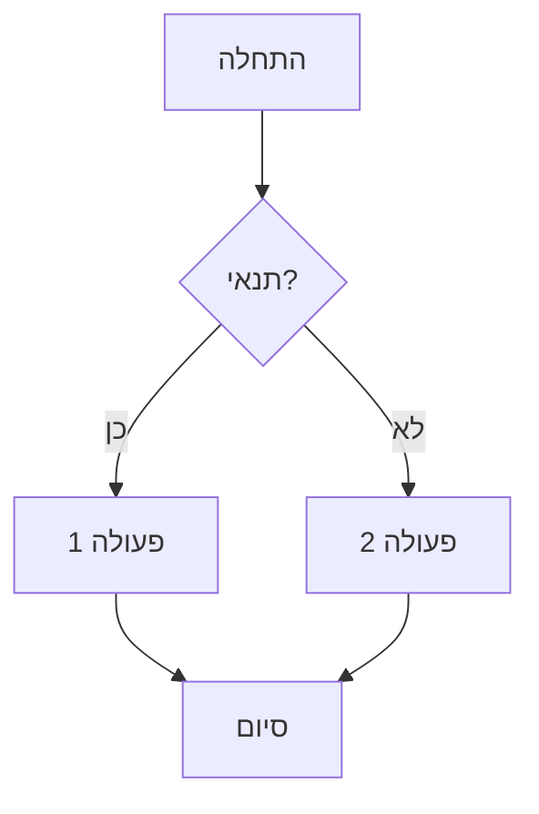
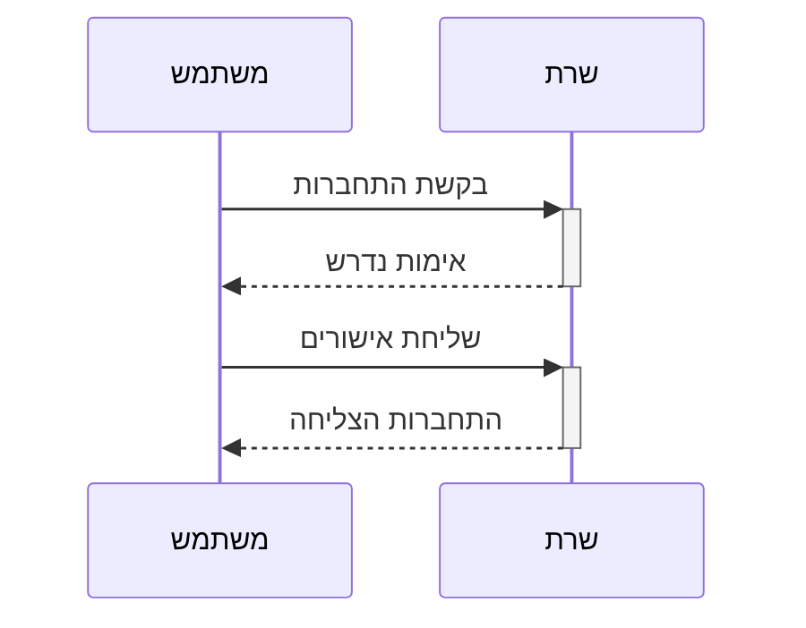

<div dir="rtl">

# מדריך כלים בסיסיים לקורס Java מתקדם

## תוכן עניינים

 <div dir="rtl">

## תוכן עניינים

- [מבנה ההשתלמות](#מבנה-ההשתלמות)
- [התחלה מהירה - הרצת קוד ראשון](#התחלה-מהירה---הרצת-קוד-ראשון)
- [IntelliJ IDEA - סביבת הפיתוח](#intellij-idea---סביבת-הפיתוח)
    - [קיצורי מקשים חיוניים](#קיצורי-מקשים-חיוניים)
    - [התאמות מומלצות](#התאמות-מומלצות)
- [Git - מערכת בקרת גרסאות](#git---מערכת-בקרת-גרסאות)
    - [התקנה והגדרה ראשונית](#התקנה-והגדרה-ראשונית)
    - [מושגי יסוד](#מושגי-יסוד)
    - [מחזור העבודה הבסיסי](#מחזור-העבודה-הבסיסי)
    - [עבודה עם ענפים](#עבודה-עם-ענפים)
    - [ביטול שינויים והחזרת גרסאות קודמות](#ביטול-שינויים-והחזרת-גרסאות-קודמות)
- [GitHub - שיתוף ועבודת צוות](#github---שיתוף-ועבודת-צוות)
    - [יצירת חשבון ומאגרים](#יצירת-חשבון-ומאגרים)
    - [עבודה מול שרת מרוחק](#עבודה-מול-שרת-מרוחק)
    - [Pull Requests וסקירות קוד](#pull-requests-וסקירות-קוד)
- [תיעוד טכני עם Markdown](#תיעוד-טכני-עם-markdown)
    - [תחביר בסיסי](#תחביר-בסיסי)
    - [תרשימים עם Mermaid](#תרשימים-עם-mermaid)
- [תרשימי זרימת עבודה](#תרשימי-זרימת-עבודה)
    - [תהליך העבודה המלא עם Git ו-GitHub](#תהליך-העבודה-המלא-עם-git-ו-github)
- [פתרון בעיות נפוצות](#פתרון-בעיות-נפוצות)
- [סיכום והמשך הקורס](#סיכום-והמשך-הקורס)
- [שלבי פיתוח Spring Boot](#שלבי-פיתוח-spring-boot)
- [שימוש בתכונות מתקדמות של Spring](#שימוש-בתכונות-מתקדמות-של-spring-repositories-וה-service-layer)
- [התקנת כלים נוספים](#התקנת-כלים-נוספים)
- [חומרי לימוד נוספים מומלצים](#חומרי-לימוד-נוספים-מומלצים)

</div>

הכלים והמיומנויות שנלמד בקורס מהווים בסיס של תרבות ה-DevOps ומתודולוגיות פיתוח אג'יליות, ומשפרים באופן משמעותי את איכות וקצב הפיתוח.

## מבנה ההשתלמות

ההשתלמות שלנו היא מעשית במהותה - לא נסתפק בתיאוריה, אלא ניישם כל נושא בצורה מעשית. חשוב לציין שמדובר בנושאים מורכבים שבעולם האמיתי דורשים זמן רב לשליטה מלאה. לכן, לא בכל נושא נצלול לעומק, אלא נציג את העקרונות והתשתיות החשובות על מנת שתכירו אותם ותוכלו בהמשך ליישמם בעצמכם.

### מבנה כל מפגש

**הכרת כלים ותשתיות:** בתחילת כל מפגש נקדיש זמן להכרת הכלים הרלוונטיים לנושא. יש לזכור שהכרת הסביבה והתשתית הטכנולוגית היא חלק בלתי נפרד מתהליך הלמידה וחשוב להקדיש לה זמן מספק.

**הקניית ידע:** הצגת הנושא, עקרונות מרכזיים והדגמות.

**תרגול מעשי:** ביצוע תרגילים מובנים במהלך המפגש, התרגילים תוכננו כך שיתמקדו בנושאים המרכזיים מבלי להיכנס לסבך של פרטים טכניים מורכבים מדי.

כדי לנצל את זמן ההשתלמות ביעילות ולמנוע תקלות, חלק ניכר מהקוד יוכן מראש. זאת מכיוון שבמערכות מורכבות כגון אלה, באגים יכולים לנבוע לא רק מהקוד עצמו אלא גם מגורמי תשתית והגדרות בסביבת העבודה. הגישה הזו תאפשר לנו להתמקד בהבנת העקרונות ובהתנסות מעשית, בלי להיתקע בבעיות טכניות.

### פרויקט מסכם

בסופה של ההשתלמות, תיישמו פרויקט אישי שישלב את הטכנולוגיות המרכזיות שנלמד - מצד השרת, דרך מסדי הנתונים ועד לצד הלקוח, כולל אבטחת מידע ברמה מקצועית.

בנוסף, נלמד לבנות מערכת Full-Stack , נלמד כיצד לשלב בין עולם ה-Java לבין Python באמצעות תקשורת בין שרתי Spring Boot לשרתי Flask ושרת FrontEnd כמו React, מיומנות הנדרשת יותר ויותר בעולם הפיתוח המודרני.

## התחלה מהירה - הרצת קוד ראשון

כדי להתחיל מיד עם Spring Boot, הנה צעדים ליצירת פרויקט ראשון בסיסי:

### יצירת פרויקט Spring Boot ראשון

1. **היכנסו ל-Spring Initializr**: [start.spring.io](https://start.spring.io/)
2. **בחרו את ההגדרות הבאות**:
    - Project: Maven
    - Language: Java
    - Spring Boot: גרסה עדכנית
    - Group: com.example
    - Artifact: demo
    - Dependencies: Spring Web, Spring Boot DevTools, Lombok
3. **לחצו על "Generate"** להורדת הפרויקט
4. **פתחו את הפרויקט ב-IntelliJ IDEA**
5. **צרו בקר ראשון**:

</div>

```java
package com.example.demo;

import org.springframework.web.bind.annotation.GetMapping;
import org.springframework.web.bind.annotation.RequestMapping;
import org.springframework.web.bind.annotation.RestController;

@RestController
@RequestMapping("/api")
public class HelloController {
    
    @GetMapping("/hello")
    public String sayHello() {
        return "Hello, Spring Boot!";
    }
}
```

<div dir="rtl">

6. **הריצו את האפליקציה** ובדקו את הכתובת: http://localhost:8080/api/hello
7. **בדקו את התוצאה באמצעות Postman** או הדפדפן

הפרויקט הבסיסי הזה מהווה את נקודת ההתחלה להשתלמות שלנו - נבין את המבנה שלו ואת האופן שבו הוא עובד, ובהמשך נרחיב אותו עם יכולות נוספות.

## IntelliJ IDEA - סביבת הפיתוח

IntelliJ IDEA היא סביבת פיתוח משולבת (IDE) מתקדמת מבית JetBrains המיועדת בעיקר לפיתוח Java, אך תומכת במגוון רחב של שפות ומסגרות עבודה.

### קיצורי מקשים חיוניים

להלן קיצורי המקשים החשובים ביותר שיחסכו לכם זמן רב:

#### עריכה בסיסית
- `Ctrl+Space` - השלמה בסיסית
- `Ctrl+Shift+Space` - השלמה חכמה
- `Ctrl+P` - מידע על פרמטרים של פונקציה
- `Ctrl+Q` - תצוגת דוקומנטציה מהירה
- `Alt+Insert` - יצירת קוד (מחלקות, שיטות, משתנים)
- `Ctrl+O` - דריסת שיטות
- `Ctrl+I` - מימוש שיטות ממשק
- `Ctrl+/` - הערת שורה
- `Ctrl+Shift+/` - הערת בלוק
- `Ctrl+D` - שכפול שורה נוכחית

#### ניווט
- `Ctrl+N` - מעבר למחלקה
- `Ctrl+Shift+N` - מעבר לקובץ
- `Ctrl+F12` - מבנה הקובץ הנוכחי
- `Alt+F7` - מציאת שימושים
- `Ctrl+B` או `Ctrl+Click` - מעבר להגדרה
- `Ctrl+Alt+B` - מעבר למימוש
- `Ctrl+G` - מעבר לשורה
- `Alt+Up/Down` - מעבר בין שיטות

#### חיפוש ועריכת קוד
- `Shift+F6` - שינוי שם
- `Ctrl+F` - חיפוש
- `Ctrl+R` - חיפוש והחלפה
- `Ctrl+Shift+F` - חיפוש בפרויקט
- `Ctrl+Shift+R` - חיפוש והחלפה בפרויקט

#### הרצה ודיבוג
- `Shift+F10` - הרצת תוכנית
- `Shift+F9` - דיבוג תוכנית
- `F8` - דילוג (Step Over)
- `F7` - כניסה (Step Into)
- `Shift+F8` - יציאה (Step Out)
- `F9` - המשך הרצה

#### רפקטורינג
- `Ctrl+Alt+L` - פרמוט קוד
- `Ctrl+Alt+O` - ארגון imports
- `Ctrl+Alt+M` - חילוץ שיטה
- `Ctrl+Alt+V` - חילוץ משתנה
- `Ctrl+Alt+F` - חילוץ שדה
- `Ctrl+Alt+C` - חילוץ קבוע

#### גודל פונט וזום
- `Ctrl+Shift++`, `Ctrl+Shift+-`, `Ctrl+Shift+0`

#### Version Control (Git)
- `Ctrl+K` - Commit שינויים
- `Ctrl+Shift+K` - Push שינויים
- `Ctrl+T` - Update פרויקט (Pull)
- `Alt+~` - תפריט VCS מהיר
- `Ctrl+Alt+Z` - Rollback שינויים מקומיים

### התאמות מומלצות

מספר התאמות שמומלץ לבצע בסביבת IntelliJ IDEA:

1. **שפת ממשק**: ניתן לשנות את שפת הממשק ב-Settings > Appearance & Behavior > Appearance > UI Options
2. **גודל פונט**: ניתן להגדיל את גודל הפונט ב-Settings > Editor > Font
3. **פלאגינים מומלצים**: Spring Boot Assistant, Lombok, Rainbow Brackets
4. **תצוגת קוד**: הפעלת מספרי שורות, הדגשת שורה נוכחית
5. **אוטו-שמירה**: הפעלת שמירה אוטומטית בעת מעבר בין חלונות

## Git - מערכת בקרת גרסאות

Git היא מערכת בקרת גרסאות מבוזרת שנוצרה על ידי לינוס טורבלדס, מאפשרת מעקב אחר שינויים בקוד ועבודה מקבילית.

### התקנה והגדרה ראשונית

#### התקנת Git

לפני השימוש ב-Git דרך IntelliJ, יש להתקין את Git במחשב:

- **Windows**: הורד והתקן מ-[git-scm.com](https://git-scm.com)
- **macOS**: התקן באמצעות Homebrew: `brew install git` או הורד מהאתר הרשמי
- **Linux**: התקן באמצעות מנהל החבילות, לדוגמה: `sudo apt install git`

#### הגדרות Git הבסיסיות

הגדר את שם המשתמש והאימייל שלך בטרמינל (או בטרמינל המשולב ב-IntelliJ):

</div>

```bash
git config --global user.name "השם שלך"
git config --global user.email "האימייל שלך"
```

<div dir="rtl">

שים לב: כברירת מחדל, הענף הראשי בפרויקטים חדשים נקרא כיום "main" ולא "master". אם ברצונך לשנות ענף קיים:

</div>

```bash
git branch -m master main
```

<div dir="rtl">

#### הגדרת Git ב-IntelliJ IDEA

1. פתח `File > Settings` (Windows/Linux) או `IntelliJ IDEA > Preferences` (macOS)
2. נווט ל-`Version Control > Git`
3. ודא שהשדה "Path to Git executable" מצביע לקובץ ההפעלה של Git (לרוב מזוהה אוטומטית)
4. לחץ על "Test" לוודא שהכל עובד כשורה

#### הגדרת חשבון GitHub

1. לך ל-`File > Settings > Version Control > GitHub`
2. לחץ על "+" כדי להוסיף חשבון
3. בחר בשיטת האימות המועדפת:
    - **Token** (מומלץ): צור Personal Access Token ב-GitHub והזן אותו
    - **Password**: הזן את שם המשתמש והסיסמה שלך
    - **OAuth**: אימות דרך דפדפן

### מושגי יסוד

בעבודה עם Git, קיימים שלושה מצבים עיקריים שבהם קבצים יכולים להימצא:

**שינויים רגילים (Working Directory)**
    - אלו הם שינויים שביצעת בקבצים במחשב שלך אבל עדיין לא "סימנת" אותם ל-Git
    - כשתריץ `git status`, קבצים אלו יופיעו תחת "Changes not staged for commit"
    - מייצגים שינויים לא גמורים, ניסיונות, או עבודה בתהליך

**Staging Area (מכונה גם "Index")**
    - אזור ביניים שבו אתה מסמן לגיט אילו שינויים אתה מתכוון לכלול ב-commit הבא
    - מגיעים לשם באמצעות הפקודה `git add filename` או בלחיצה על "+" ליד קובץ ב-IntelliJ
    - קבצים ב-staging יופיעו תחת "Changes to be committed"
    - מייצג הכנה לקראת commit - אתה בוחר אילו שינויים מוכנים להיכנס להיסטוריה של הפרויקט

**Commit (לאחר שמירה)**
    - נקודת שמירה קבועה בהיסטוריית הפרויקט - כמו "צילום מסך" של מצב הקוד
    - מגיעים לשם באמצעות הפקודה `git commit -m "הודעה"` או לחיצה על "Commit" ב-IntelliJ
    - שינויים שבוצע להם commit כבר לא מופיעים ב-`git status` הרגיל, אלא נכנסים להיסטוריה
    - מייצג נקודת ציון רשמית בהיסטוריית הפרויקט, שינויים שהושלמו והפכו לחלק מהפרויקט

### מחזור העבודה הבסיסי

להלן תהליך העבודה היומיומי עם Git:

#### 1. משיכת שינויים מהשרת (Pull)

לפני תחילת עבודה, תמיד כדאי למשוך את השינויים העדכניים:

- **קיצור מקשים**: `Ctrl+T`
- **תפריט**: `Git > Pull`

#### 2. עריכת קוד

ערוך את הקוד בסביבת IntelliJ. שים לב לסימוני הצבע בשוליים:
- **ירוק**: שורות שנוספו
- **כחול**: שורות ששונו
- **אדום במרקר**: שורות שנמחקו

#### 3. הוספת קבצים (Staging)

- בחר קבצים בחלון ה-Project או בחלון ה-Git (`Alt+9`)
- לחץ ימני ובחר "Add to VCS"
- או לחץ ימני על הפרויקט/תיקייה ובחר `Git > Add`

#### 4. ביצוע Commit (שמירת השינויים מקומית)

- **קיצור מקשים**: `Ctrl+K`
- **תפריט**: `Git > Commit`
- הזן הודעת Commit משמעותית המתארת את השינויים
- סמן את הקבצים שתרצה לכלול ב-Commit
- לחץ "Commit" (לשמירה מקומית) או "Commit and Push" (לשמירה ודחיפה מיידית)

#### 5. דחיפת שינויים לשרת (Push)

- **קיצור מקשים**: `Ctrl+Shift+K`
- **תפריט**: `Git > Push`
- בחר את הענף ליעד ולחץ "Push"

### עבודה עם ענפים

ענפים מאפשרים פיתוח מקביל של תכונות שונות:

#### יצירת ענף חדש

</div>

```bash
git branch new-feature
git checkout new-feature
   
# או בפקודה אחת
git checkout -b new-feature
```

<div dir="rtl">

#### מעבר בין ענפים

</div>

```bash
git checkout branch-name
```

<div dir="rtl">

#### מיזוג ענפים

</div>

```bash
# עבור לענף היעד (בדרך כלל main)
git checkout main
   
# מזג את הענף החדש
git merge new-feature
```

<div dir="rtl">

#### דחיפת ענף חדש ל-GitHub

</div>

```bash
git push -u origin new-feature
```

<div dir="rtl">

### ביטול שינויים והחזרת גרסאות קודמות

Git מאפשר לבטל שינויים בכל אחד מהשלבים במחזור העבודה:

#### ביטול שינויים שעדיין לא נוספו ל-Staging

כאשר ערכת קבצים אך עדיין לא הוספת אותם ל-Staging Area (לא ביצעת `git add`):

**באמצעות IntelliJ IDEA**:
לחץ ימני על הקובץ > `Local History` > `Show History` > בחר גרסה קודמת > `Revert`

**באמצעות טרמינל**:

</div>

```bash
# ביטול שינויים בקובץ ספציפי
git restore filename.txt

# בגרסאות ישנות יותר של Git
git checkout -- filename.txt

# ביטול כל השינויים שטרם נוספו ל-Staging
git restore .
```

<div dir="rtl">

#### ביטול שינויים שכבר נוספו ל-Staging

כאשר כבר הוספת קבצים ל-Staging (ביצעת `git add`) אך עדיין לא ביצעת commit:

**באמצעות IntelliJ IDEA**:
1. פתח את חלון ה-Git (`Alt+9`) > לשונית "Local Changes" > "Staged" > לחץ ימני על הקובץ > `Unstage Changes`
2. לאחר הסרה מ-Staging, השתמש באחת השיטות מהסעיף הקודם לביטול השינויים עצמם

</div>

**באמצעות טרמינל**:
```bash
# הסרת קובץ ספציפי מה-Staging
git restore --staged filename.txt

# הסרת כל הקבצים מה-Staging
git restore --staged .

# הסרה מה-Staging וגם ביטול השינויים בקובץ
git restore --staged filename.txt && git restore filename.txt
```

<div dir="rtl">

#### ביטול Commit אחרון (עם שמירת השינויים)

לביטול commit אחרון תוך השארת השינויים כשינויים פעילים:

**באמצעות IntelliJ IDEA**:
1. פתח את חלון ה-Git Log (`Alt+9` > לשונית "Log")
2. לחץ ימני על ה-commit האחרון
3. בחר `Reset Current Branch to Here...`
4. בחר באפשרות "Soft"
5. אשר את הפעולה

**באמצעות טרמינל**:

## ביטול ה-commit האחרון עם שמירת השינויים
</div>

```bash

git reset --soft HEAD~1
```

<div dir="rtl">

#### ביטול Commit אחרון (כולל מחיקת השינויים)

לביטול מוחלט של commit אחרון כולל השינויים עצמם:

**באמצעות IntelliJ IDEA**:
1. פתח את חלון ה-Git Log (`Alt+9` > לשונית "Log")
2. לחץ ימני על ה-commit האחרון
3. בחר `Reset Current Branch to Here...`
4. בחר באפשרות "Hard"
5. אשר את הפעולה

**באמצעות טרמינל**:

# ביטול ה-commit האחרון כולל מחיקת השינויים#
</div>

```bash
git reset --hard HEAD~1
```

<div dir="rtl">

## GitHub - שיתוף ועבודת צוות

GitHub היא פלטפורמת ענן לאחסון, ניהול ושיתוף פעולה על מאגרי Git, כיום בבעלות Microsoft.

### יצירת חשבון ומאגרים

#### יצירת חשבון
1. גש לאתר [GitHub](https://github.com)
2. לחץ על "Sign up" והזן את הפרטים הנדרשים (שם משתמש, אימייל וסיסמה)
3. עקוב אחר שלבי האימות והשלם את הרישום

#### יצירת מאגר חדש
1. לחץ על סמל ה-"+" בפינה העליונה ובחר "New repository"
2. הזן שם למאגר (רצוי באנגלית, ללא רווחים)
3. הוסף תיאור קצר (אופציונלי)
4. בחר אם המאגר יהיה ציבורי (כולם יכולים לראות) או פרטי (רק מי שתזמין)
5. בחר .gitignore מתאים לשפת התכנות שלך (אם רלוונטי)
6. לחץ על "Create repository"

#### הגדרת קובץ .gitignore

קובץ זה מגדיר אילו קבצים ותיקיות לא ינוהלו ב-Git:

1. לחץ ימני על שורש הפרויקט
2. בחר `New > File` וקרא לו `.gitignore`
3. הוסף תבניות לקבצים ותיקיות שברצונך להתעלם מהם, לדוגמה:

</div>

```
# קבצי IntelliJ IDEA
.idea/
*.iml
*.iws
*.ipr
out/

# קבצי Java
*.class
*.jar
target/

# קבצים אחרים
.DS_Store
```

<div dir="rtl">


### עבודה מול שרת מרוחק

#### Clone - שכפול מאגר מ-GitHub למחשב המקומי

כאשר רוצים להוריד עותק של מאגר קיים מ-GitHub למחשב המקומי:

1. **באתר GitHub**:
    - נווט למאגר שברצונך לשכפל
    - לחץ על כפתור


#### Clone - שכפול מאגר מ-GitHub למחשב המקומי (המשך)

1. **באתר GitHub**:
    - נווט למאגר שברצונך לשכפל
    - לחץ על כפתור "Code" הירוק
    - העתק את כתובת ה-URL של המאגר (HTTPS או SSH)

2. **בטרמינל המקומי**:


</div>

   ```bash
   git clone https://github.com/username/repository-name.git
   ```

<div dir="rtl">

3. **ב-IntelliJ IDEA**:
    - בחר `File > New > Project from Version Control`
    - הדבק את ה-URL של המאגר
    - בחר תיקיית יעד ולחץ על "Clone"

#### Push - דחיפת שינויים מקומיים ל-GitHub

לאחר ביצוע שינויים ו-commit מקומי, כדי לעדכן את המאגר ב-GitHub:

1. **בטרמינל**:

</div>

   ```bash
   # ראשית, ודא שאתה בענף הנכון
   git branch

   # דחיפת השינויים לשרת המרוחק
   git push origin branch-name

   # לענף main
   git push origin main
   ```

<div dir="rtl">

2. **ב-IntelliJ IDEA**:
    - `Ctrl+Shift+K` או `Git > Push`
    - בחר את הענף ליעד ולחץ על "Push"

#### Pull - משיכת שינויים מ-GitHub למחשב המקומי

כאשר יש שינויים במאגר המרוחק שברצונך לקבל למחשב המקומי:

1. **בטרמינל**:

</div>

   ```bash
   # משיכת השינויים מהשרת המרוחק
   git pull origin branch-name

   # לענף main
   git pull origin main
   ```

<div dir="rtl">

2. **ב-IntelliJ IDEA**:
    - `Ctrl+T` או `Git > Pull`
    - בחר את המקור והענף ולחץ על "Pull"

### Pull Requests וסקירות קוד

Pull Request (PR) הוא מנגנון ב-GitHub לבקשת מיזוג שינויים מענף אחד לאחר:

#### יצירת Pull Request
1. לאחר שדחפת ענף חדש ל-GitHub, גש לדף המאגר ב-GitHub
2. יופיע באנר המציע ליצור Pull Request מהענף החדש, או לחץ על "Pull requests" > "New pull request"
3. בחר את הענף המקור (שלך) ואת ענף היעד (בדרך כלל main)
4. הוסף כותרת ותיאור המסבירים את השינויים
5. לחץ על "Create pull request"

#### סקירת קוד
1. במסך ה-PR, לחץ על לשונית "Files changed" לראות את כל השינויים
2. אפשר להוסיף הערות על שורות ספציפיות על-ידי לחיצה על ה-"+" שמופיע כשמרחפים מעל שורה
3. לאחר סקירה, אפשר לאשר בכפתור "Review changes" ולבחור:
    - Comment: רק להוסיף הערה
    - Approve: לאשר את השינויים
    - Request changes: לבקש שינויים נוספים

#### מיזוג Pull Request
לאחר סקירה ואישור:
1. לחץ על כפתור "Merge pull request"
2. בחר בשיטת המיזוג (מיזוג רגיל, squash, או rebase)
3. אשר את המיזוג

## תיעוד טכני עם Markdown

Markdown הוא פורמט סימון קל משקל שנוצר בשנת 2004 על ידי ג'ון גרובר וארון שוורץ. הוא מאפשר כתיבת תוכן מעוצב באמצעות תחביר פשוט וקריא.

### תחביר בסיסי

#### כותרות:
```markdown
# כותרת ראשית
## כותרת משנית
### כותרת רמה 3
```

#### פורמט טקסט:
```markdown
**מודגש**
*נטוי*
~~קו חוצה~~
```

#### רשימות:
```markdown
- פריט ברשימה
- פריט שני
  - תת-פריט

1. פריט ממוספר
2. פריט שני
```

#### קישורים ותמונות:
```markdown
[טקסט הקישור](https://www.example.com)

```

#### קוד:
```markdown
`קוד בשורה`

```python
# בלוק קוד עם הדגשת תחביר
def hello():
    print("Hello World!")
``` 
```

#### טבלאות:
```markdown
| כותרת 1 | כותרת 2 |
|----------|----------|
| תא 1    | תא 2    |
| תא 3    | תא 4    |
```

### תרשימים עם Mermaid

Mermaid הוא כלי JavaScript המאפשר יצירת תרשימים ודיאגרמות באמצעות תחביר דמוי-Markdown:

#### תרשים זרימה בסיסי:


#### תרשים רצף:


## תרשימי זרימת עבודה

### תהליך העבודה המלא עם Git ו-GitHub

להלן תרשים המתאר את תהליך העבודה המלא עם Git ו-GitHub:

```mermaid
graph LR
%% הגדרת תתי-מקטעים
   subgraph WorkingDirectory [Working Directory]
      A["Working Directory\nשינויים מקומיים"]
      A2["שינויים מקומיים שטרם"]
      A3[" Staging הוכנסו אל "]
   end

   subgraph GitLocal [Git Local]
      B["Staging Area\nשינויים מוכנים"]
      C["Local Repository\ncommit  שינויים ששמרת  על ידי"]
      E["New Branch\nענף חדש"]
      F["History\nהיסטוריית שינויים"]
   end

   subgraph GitHub [GitHub]
      D["Remote Repository\nמאגר GitHub"]
      G["Pull Request\nבקשת משיכה"]
      H["Issues\nמעקב משימות"]
      I["Actions\nאוטומציה CI/CD"]
   end

%% הקשרים הבסיסיים
   A -->|"git add"| B
   B -->|"git commit"| C
   C -->|"git push"| D
   D -->|"git pull"| A

%% פעולות חזרה
   B -->|"git restore --staged"| A
   C -->|"git reset --soft"| B
   C -->|"git reset --hard"| A

%% ענפים והיסטוריה
   C -->|"git branch"| E
   C -->|"git log"| F

%% פעולות GitHub
   D -->|"Create"| G
   D -->|"Track"| H
   D -->|"Automate"| I

%% עיצוב צבעים לפי מקטעים
   classDef workingDir fill:#7e0073,stroke:#787878,stroke-width:2px, font-size:20px
   classDef gitLocal fill:#007e00,stroke:#333,stroke-width:2px, font-size:20px
   classDef github fill:#123454,stroke:#656556,stroke-width:2px, font-size:20px

%% עיצוב תתי-מקטעים
   classDef workingDirSection fill:#7e0073,stroke:#787878,stroke-width:2px, font-size:1em
   classDef gitLocalSection fill:#007e00,stroke:#333,stroke-width:2px, font-size:1em
   classDef githubSection fill:#123454,stroke:#656556,stroke-width:2px, font-size:1em

%% הגדרת צבעים לפי קבוצות
   class A workingDir
   class B,C,E,F gitLocal
   class D,G,H,I github


%% הגדרת צבעי קשתות לפי מקור
   linkStyle 0 stroke:#7e0073,stroke-width:2px, font-size:20px, weight: bold
   linkStyle 4 stroke:#7e0073,stroke-width:2px, font-size:20px, weight: bold
   linkStyle 1 stroke:#007e00,stroke-width:2px, font-size:20px, weight: bold
   linkStyle 2 stroke:#007e00,stroke-width:2px, font-size:20px, weight: bold
   linkStyle 6 stroke:#7e0073,stroke-width:2px, font-size:20px, weight: bold
   linkStyle 7 stroke:#007e00,stroke-width:2px, font-size:20px, weight: bold
   linkStyle 8 stroke:#007e00,stroke-width:2px, font-size:20px, weight: bold
   linkStyle 3 stroke:#7e0073,stroke-width:2px, font-size:20px, weight: bold
   linkStyle 9 stroke:#123454,stroke-width:2px, font-size:20px, weight: bold
   linkStyle 10 stroke:#123454,stroke-width:2px, font-size:20px, weight: bold
   linkStyle 11 stroke:#123454,stroke-width:2px, font-size:20px, weight: bold
   linkStyle 5 stroke:#007e00,stroke-width:2px, font-size:20px, weight: bold

```



## פתרון בעיות נפוצות

### בעיות התחברות ל-GitHub
- **בעיה**: אסימון (token) לא בתוקף
- **פתרון**: חדש את האסימון ב-GitHub והגדר מחדש ב-IntelliJ

### שגיאות Push
- **בעיה**: "rejected - non-fast forward"
- **פתרון**: בצע Pull לפני ה-Push כדי לשלב שינויים מרוחקים

### "Repository already exists" בעת ניסיון להעלות פרויקט ל-GitHub
- **פתרון**:

</div>


<div dir="ltr">


```bash
git remote add origin https://github.com/USERNAME/REPO-NAME.git
git pull origin main --allow-unrelated-histories
git push -u origin main
```

</div>

<div dir="rtl">

### פתרון התנגשויות (Conflicts)
1. זהה קבצים עם התנגשויות (מסומנים ב-IntelliJ בצבע אדום)
2. פתח את הקבצים ותמצא סימונים כמו:

</div>

<div dir="ltr">

   ```
   <<<<<<< HEAD
   הגרסה המקומית שלך
   =======
   הגרסה מהשרת המרוחק
   >>>>>>> branch-name
   ```

</div>

<div dir="rtl">


3. ערוך את הקוד ידנית או השתמש בממשק הפתרון של IntelliJ
4. לאחר פתרון כל ההתנגשויות, בצע commit חדש

## סיכום והמשך הקורס

במדריך זה סקרנו את הכלים הבסיסיים לפיתוח מודרני עם Java:
- **IntelliJ IDEA** כסביבת הפיתוח המרכזית
- **Git** לניהול גרסאות וקוד
- **GitHub** לשיתוף פעולה ועבודת צוות
- **CI/CD** באמצעות GitHub Actions
- **Markdown** לתיעוד טכני
- **Postman** לבדיקה וניהול API
- **Docker Desktop** לניהול קונטיינרים
- **MySQL** כמסד נתונים יחסי

## שלבי פיתוח Spring Boot

בהשתלמות נעבור על שלבי פיתוח מדורגים, כשכל שלב בונה על השלב הקודם:

### שלב 1: אפליקציית Spring Boot בסיסית
- מחלקת היישום הראשית עם `@SpringBootApplication`
- הבנת מה קורה מאחורי הקלעים

### שלב 2: הוספת בקר בסיסי
- בקר בסיסי שמחזיר תגובה פשוטה
- הבנת המנגנון של Spring MVC

### שלב 3: ארכיטקטורת שכבות
- מודל: מחלקת Student
- שירות: StudentService
- בקר: StudentController
- הבנת הזרימה והקשרים בין השכבות

### שלב 4: שימוש ב-REST עם פעולות CRUD מלאות
- הרחבת הבקר לתמיכה ב-GET, POST, PUT, DELETE
- שימוש ב-Lombok להפחתת קוד שגרתי
- החזרת הודעות מצב כחלק מתשובת ה-API

### שלב 5: טיפול בשגיאות והחזרות ResponseEntity
- שימוש ב-ResponseEntity לשליטה מלאה בתגובת HTTP
- החזרת קודי סטטוס מתאימים (200, 201, 404, וכו')
- זריקת חריגים מותאמים אישית

### שלב 5.1: טיפול גלובלי בחריגות
- שימוש ב-@ControllerAdvice לטיפול מרוכז בחריגות
- יצירת ErrorResponse אחיד
- שימוש בקוד סטטוס 409 Conflict למקרים מתאימים

### שלב 5.2: ולידציה
- שימוש ב-@Valid לולידציה אוטומטית של משאבים
- חיבור ולידציה למערך טיפול החריגות

## שימוש בתכונות מתקדמות של Spring: Repositories וה-Service Layer

בפיתוח עם Spring, אחד היתרונות הגדולים הוא ארגון נכון של שכבות האפליקציה. בואו נסביר את היתרונות של שימוש ב-Repository Pattern ו-Service Layer לעומת גישה ישירה למסד הנתונים.

    - עדיף להשתמש ב-Repository, שמנהל עבורנו שאילתות בסיסיות, במקום לכתוב HQL ידני.

### פתרון עם Repository ו-Service Layer

#### למה להשתמש ב-Service?
- **הפרדת אחריות** - ה-Controller מטפל ב-HTTP, ה-Service מנהל את הלוגיקה העסקית.
- **גמישות** - נוכל להחליף Repository בלי לשנות את ה-Controller.
- **תחזוקה קלה יותר** - אין שאילתות חופפות במקומות שונים.

#### למה Repository ?
- **פחות קוד** - JpaRepository מטפל בכל הפעולות הנפוצות.
- **הפרדה בין שכבות** - Controller רק מטפל ב-HTTP, Service מנהל לוגיקה עסקית.
- **ניתן להחליף מסד נתונים בלי לשנות את הקוד** .
- **תמיכה בשאילתות חכמות עם Spring Data JPA** - כמו findByUsername().

## התקנת כלים נוספים

### Postman - כלי לבדיקה וניהול API

Postman הוא כלי פופולרי המאפשר לבדוק ממשקי API, לנהל אוספי בקשות, ולתעד שירותים.

#### התקנה
1. **הורדה**: גש לאתר הרשמי של [Postman](https://www.postman.com/downloads/)
2. **התקנה**: עקוב אחר הוראות האשף
3. **וידוא התקנה**: הפעל את Postman לוודא שההתקנה הושלמה בהצלחה

### Docker Desktop - ניהול קונטיינרים

Docker מאפשר ניהול והפעלת קונטיינרים, מה שמקל על הרצת סביבות פיתוח וייצור באופן עקבי.

#### התקנה
1. **הורדה**: גש לאתר הרשמי של [Docker Desktop](https://www.docker.com/products/docker-desktop)
2. **התקנה**: עקוב אחרי הוראות ההתקנה
3. **וידוא התקנה**: הפעל את Docker Desktop

### MySQL - מסד נתונים יחסי

ניתן להתקין MySQL באמצעות Docker או באופן מסורתי ישירות במערכת ההפעלה.

#### התקנת MySQL באמצעות Docker
הפעלת קונטיינר MySQL עם משתמש וסיסמה מוגדרים.

### MySQL Workbench - ממשק גרפי לניהול MySQL

MySQL Workbench הוא כלי גרפי לניהול בסיסי נתונים של MySQL.

## הבנת IoC (Inversion of Control) ו-DI (Dependency Injection)

ההבנה של IoC ו-DI באה לידי ביטוי בצורה המוחשית ביותר במערכות גדולות. כל עוד עובדים על קוד קטן ופשוט, אפשר בקלות לפספס את היתרונות של DI, כי אפשר "להסתדר" גם בלי זה.

במערכת Spring Boot, DI משמש לניהול של רכיבים (Beans) - כלומר, במקום שאנחנו ניצור אובייקטים בעצמנו (new MyClass()), ה-Container של Spring עושה את זה עבורנו.

**היתרונות באים לידי ביטוי בעיקר ב:**

1. **ניהול תלויות בצורה אוטומטית** - אם שירות אחד תלוי בשירות אחר, Spring ידאג להזריק אותו בלי שנצטרך לדאוג.

2. **הפרדת קוד ושיפור התחזוקה** - אין תלות קשיחה בין מחלקות, מה שמאפשר להחליף רכיבים בלי לשבור את המערכת.

3. **גמישות גבוהה (Configuration Management)** - ניתן להחליף בקלות יישומים, למשל חיבור למסד נתונים שונה, בלי לגעת בקוד.

4. **בדיקות (Testing) - קלות ביצוע Unit Tests** - אפשר להחליף תלויות בקלות כדי לבדוק רכיב מסוים מבלי להפעיל את כל המערכת.

## דגשים לנקודות עיקריות

### יתרונות ארכיטקטורת שכבות
- **הפרדת אחריות**:
    - Controller - טיפול בבקשות HTTP
    - Service - לוגיקה עסקית
    - Model - ייצוג הנתונים
- **תחזוקה קלה יותר** - שינויים ממוקדים בשכבה הרלוונטית
- **אפשרות לבדיקות יחידה** - בדיקת כל שכבה בנפרד

### חשיבות הזרקת תלויות (DI)
- **צימוד חלש** בין רכיבים
- **בדיקות פשוטות יותר** - החלפת תלויות אמיתיות ב-Mocks
- **גמישות** - החלפת מימושים ללא שינוי בקוד הקורא
- **ניהול מחזור חיים** על ידי Spring
- **הפחתת קוד שגרתי** - Spring מטפל ביצירת אובייקטים וקישור תלויות

## משימה לתרגול

יש ליצור פרויקט Spring Boot וליישם את הרכיבים הבאים:

1. מחלקת מודל `Student` עם השדות:
    - מזהה (id) - Long
    - שם פרטי (firstName) - String
    - שם משפחה (lastName) - String
    - גיל (age) - double

2. מחלקת שירות `StudentService` שמכילה:
    - רשימה קבועה של 3-5 סטודנטים
    - מתודה להחזרת כל הסטודנטים

3. בקר `StudentController` עם:
    - נקודת קצה GET ב-"/student/getAllStudents" שמחזירה את כל הסטודנטים

4. יש לבדוק את הפעולה התקינה של האפליקציה בגישה ל-http://localhost:8080/student/getAllStudents

## חומרי לימוד נוספים מומלצים

- הדוקומנטציה הרשמית של [Spring Framework](https://docs.spring.io/spring-framework/reference/)
- הדוקומנטציה הרשמית של [Spring Boot](https://docs.spring.io/spring-boot/docs/current/reference/html/)
- ספר: "Spring in Action" מאת Craig Walls
- מדריכים ב-Baeldung: [https://www.baeldung.com/spring-boot](https://www.baeldung.com/spring-boot)

</div>