# תרשים זרימת העבודה ב-Git ו-GitHub

התרשים שלהלן מתאר את תהליך העבודה המלא עם Git ו-GitHub, כולל ניהול קבצי Markdown ופעולות Checkout. אסביר כל חלק בתרשים בפירוט.

```mermaid
graph LR
%% הגדרת תתי-מקטעים
    subgraph WorkingDirectory [Working Directory]
        A["Working Directory\nשינויים מקומיים"]
        A2["שינויים מקומיים שטרם"]
        A3[" Staging הוכנסו אל "]
    end

    subgraph GitLocal [Git Local]
        B["Staging Area\nשינויים מוכנים"]
        C["Local Repository\ncommit  שינויים ששמרת  על ידי"]
        E["New Branch\nענף חדש"]
        F["History\nהיסטוריית שינויים"]
    end

    subgraph GitHub [GitHub]
        D["Remote Repository\nמאגר GitHub"]
        G["Pull Request\nבקשת משיכה"]
        H["Issues\nמעקב משימות"]
        I["Actions\nאוטומציה CI/CD"]
    end

%% הקשרים הבסיסיים
    A -->|"git add"| B
    B -->|"git commit"| C
    C -->|"git push"| D
    D -->|"git pull"| A

%% פעולות חזרה
    B -->|"git restore --staged"| A
    C -->|"git reset --soft"| B
    C -->|"git reset --hard"| A

%% ענפים והיסטוריה
    C -->|"git branch"| E
    C -->|"git log"| F

%% פעולות GitHub
    D -->|"Create"| G
    D -->|"Track"| H
    D -->|"Automate"| I

%% עיצוב צבעים לפי מקטעים
    classDef workingDir fill:#7e0073,stroke:#787878,stroke-width:2px, font-size:20px
    classDef gitLocal fill:#007e00,stroke:#333,stroke-width:2px, font-size:20px
    classDef github fill:#123454,stroke:#656556,stroke-width:2px, font-size:20px

%% עיצוב תתי-מקטעים
    classDef workingDirSection fill:#7e0073,stroke:#787878,stroke-width:2px, font-size:1em
    classDef gitLocalSection fill:#007e00,stroke:#333,stroke-width:2px, font-size:1em
    classDef githubSection fill:#123454,stroke:#656556,stroke-width:2px, font-size:1em

%% הגדרת צבעים לפי קבוצות
    class A workingDir
    class B,C,E,F gitLocal
    class D,G,H,I github


%% הגדרת צבעי קשתות לפי מקור
    linkStyle 0 stroke:#7e0073,stroke-width:2px, font-size:20px, weight: bold
    linkStyle 4 stroke:#7e0073,stroke-width:2px, font-size:20px, weight: bold
    linkStyle 1 stroke:#007e00,stroke-width:2px, font-size:20px, weight: bold
    linkStyle 2 stroke:#007e00,stroke-width:2px, font-size:20px, weight: bold
    linkStyle 6 stroke:#7e0073,stroke-width:2px, font-size:20px, weight: bold
    linkStyle 7 stroke:#007e00,stroke-width:2px, font-size:20px, weight: bold
    linkStyle 8 stroke:#007e00,stroke-width:2px, font-size:20px, weight: bold
    linkStyle 3 stroke:#7e0073,stroke-width:2px, font-size:20px, weight: bold
    linkStyle 9 stroke:#123454,stroke-width:2px, font-size:20px, weight: bold
    linkStyle 10 stroke:#123454,stroke-width:2px, font-size:20px, weight: bold
    linkStyle 11 stroke:#123454,stroke-width:2px, font-size:20px, weight: bold
    linkStyle 5 stroke:#007e00,stroke-width:2px, font-size:20px, weight: bold

```

## הסבר התרשים

### הרכיבים העיקריים

1. **Working Directory (שינויים מקומיים)**
    - זהו המצב הראשוני של הקבצים בתיקיית הפרויקט שלך
    - כאן אתה מבצע שינויים בקוד, יוצר קבצים חדשים, או מוחק קבצים קיימים
    - שינויים אלה עדיין לא נמצאים תחת מעקב של Git (או שהם נמצאים במצב "modified")

2. **Staging Area (שינויים מוכנים)**
    - אזור ביניים שבו אתה מסמן לגיט אילו שינויים אתה מתכוון לכלול ב-commit הבא
    - מאפשר לך לבחור רק חלק מהשינויים שביצעת להיכלל ב-commit
    - גם מכונה "Index" בטרמינולוגיה של Git

3. **Local Repository (שינויים ששמרת ב-commit)**
    - המאגר המקומי שלך, שמכיל את כל ההיסטוריה של ה-commits
    - כל commit מייצג נקודת זמן בהיסטוריית הפרויקט
    - נמצא בתיקיית `.git` בתוך תיקיית הפרויקט שלך

4. **Remote Repository (מאגר ב-GitHub)**
    - עותק של המאגר שנמצא בשרת מרוחק (GitHub, GitLab, וכו')
    - מאפשר שיתוף פעולה עם מפתחים אחרים
    - משמש כגיבוי ל-repository המקומי שלך

### הקשרים הבסיסיים

5. **git add** (מ-Working Directory ל-Staging Area)
    - מוסיף שינויים מהתיקייה שלך ל-Staging Area
    - דוגמה: `git add filename.txt` או `git add .` (להוספת כל השינויים)
        - בIntelliJ: לחצן ימני על הקבץ ובתפריט לבחר Git  +
    - בIntelliJ: לחיצה על סימן ה-"+" ליד הקובץ בחלון ה-Git

6. **git commit** (מ-Staging Area ל-Local Repository)
    - יוצר "נקודת שמירה" במאגר המקומי שלך עם השינויים שהוספת ל-Staging
    - דוגמה: `git commit -m "הוספת תכונה חדשה"`
    - בIntelliJ: `Ctrl+K` או כפתור ה-Commit בחלון ה-Git

7. **git push** (מ-Local Repository ל-Remote Repository)
    - שולח את ה-commits המקומיים שלך לשרת המרוחק (GitHub)
    - דוגמה: `git push origin main`
    - בIntelliJ: `Ctrl+Shift+K` או כפתור ה-Push בחלון ה-Git

8. **git pull** (מ-Remote Repository ל-Working Directory)
    - מושך שינויים מהשרת המרוחק ומשלב אותם במאגר המקומי שלך
    - דוגמה: `git pull origin main`
    - בIntelliJ: `Ctrl+T` או כפתור ה-Pull בחלון ה-Git

### פעולות חזרה (ביטול שינויים)

9. **git restore --staged** (מ-Staging Area בחזרה ל-Working Directory)
    - מסיר שינויים מה-Staging Area, אך משאיר אותם כשינויים ב-Working Directory
    - דוגמה: `git restore --staged filename.txt`
    - בIntelliJ: לחיצה ימנית על קובץ ב-Staged ובחירה ב-"Rollback" או "Unstage"

10. **git reset --soft** (מ-Local Repository בחזרה ל-Staging Area)
    - מבטל commit, אבל משאיר את השינויים ב-Staging Area
    - דוגמה: `git reset --soft HEAD~1` (ביטול ה-commit האחרון)
    - בIntelliJ: לחיצה ימנית על commit > "Reset Current Branch to Here..." > בחירה ב-"Soft"
    - **חשוב**: פועל על כל הפרויקט, לא על קבצים בודדים

11. **git reset --hard** (מ-Local Repository בחזרה ל-Working Directory)
    - מבטל commit ומוחק את השינויים לחלוטין
    - דוגמה: `git reset --hard HEAD~1` (ביטול ה-commit האחרון ומחיקת השינויים)
    - בIntelliJ: לחיצה ימנית על commit > "Reset Current Branch to Here..." > בחירה ב-"Hard"
    - **שים לב**: זו פעולה הרסנית שמוחקת שינויים לחלוטין
    - **חשוב**: פועל על כל הפרויקט, לא על קבצים בודדים

### פעולות Checkout 

12. **git checkout -- file** (שחזור קובץ למצב ב-commit האחרון)
    - משחזר קובץ למצב שלו ב-commit האחרון (HEAD)
    - דוגמה: `git checkout -- filename.txt`
    - בIntelliJ: לחיצה ימנית על קובץ > Git > Rollback
    - **שים לב**: שינויים שלא בוצע להם commit יאבדו
    - **הבדל מ-reset**: פועל על קבצים בודדים, לא משנה את ה-HEAD

13. **git checkout commit -- file** (שחזור קובץ מcommit ספציפי)
    - משחזר קובץ למצב שלו בcommit ספציפי ומוסיף אותו ל-staging area
    - דוגמה: `git checkout HEAD~1 -- filename.txt` (שחזור הקובץ מהcommit הקודם)
    - או: `git checkout abcd1234 -- filename.txt` (שחזור לפי hash ספציפי)
    - בIntelliJ: פתיחת חלון היסטוריית Git > מציאת commit > לחיצה ימנית > Get from Branch
    - **יתרון**: מאפשר לשחזר קובץ בודד מגרסה קודמת מבלי להשפיע על שאר הפרויקט

14. **git checkout branch** (מעבר בין ענפים)
    - מחליף את כל Working Directory לתוכן של הענף המבוקש
    - דוגמה: `git checkout feature-branch`
    - בIntelliJ: לחיצה על שם הענף בפינה הימנית התחתונה > בחירת הענף הרצוי
    - **השפעה**: משנה את כל הקבצים בפרויקט לגרסה שבענף המבוקש

### ענפים והיסטוריה

15. **git branch** (יצירת ענף חדש)
    - יוצר ענף חדש (branch) מנקודת ה-commit הנוכחית
    - דוגמה: `git branch new-feature`
    - בIntelliJ: `Git > Branches... > New Branch`

16. **git log** (צפייה בהיסטוריית השינויים)
    - מציג את היסטוריית ה-commits של המאגר
    - דוגמה: `git log` או `git log --oneline` לתצוגה מקוצרת
    - בIntelliJ: `Alt+9` > בחירה בלשונית "Log"

### פעולות GitHub

17. **Pull Request (בקשת משיכה)**
    - מנגנון ב-GitHub לבקשת מיזוג שינויים מענף אחד לאחר
    - משמש בעיקר לסקירת קוד ועבודה משותפת
    - בIntelliJ: כלי Pull Requests בחלון ה-Git

18. **Issues (מעקב משימות)**
    - מערכת מעקב אחר משימות, באגים, ובקשות תכונות חדשות
    - משמשת לניהול פרויקט ותקשורת בין מפתחים

19. **Actions (אוטומציה CI/CD)**
    - מערכת של GitHub לאוטומציה של תהליכי בדיקה, בנייה ופריסה
    - מריצה בדיקות אוטומטיות בכל פעם שמבוצע push למאגר
    - יכולה לבנות ולפרוס את היישום באופן אוטומטי

### קבצי Markdown וסוגיהם

20. **Markdown (.md) (תיעוד רגיל)**
    - פורמט סימון קל לכתיבת מסמכים מעוצבים
    - משמש בעיקר לקבצי README, תיעוד ו-Wiki
    - תחביר פשוט שקל לקריאה גם בצורתו הגולמית

21. **MultiMarkdown (.mmd) (תיעוד מורחב)**
    - הרחבה של Markdown עם תכונות נוספות
    - תומך במטא-נתונים, הערות שוליים, טבלאות מורכבות, ועוד
    - שימושי עבור מסמכים מורכבים יותר

22. **Mermaid (תרשימים בקוד)**
    - שפה לתיאור דיאגרמות ותרשימים בתוך קבצי Markdown
    - מאפשר יצירת תרשימי זרימה, רצף, גאנט, ועוד
    - הקוד מומר לתרשים ויזואלי בעת הצגת ה-Markdown

## טבלת השוואה בין פקודות Checkout ו-Reset

| פקודה | היקף פעולה | שמירת שינויים | שימוש נפוץ | הערות |
|-------|------------|---------------|------------|--------|
| `git checkout -- file` | קובץ ספציפי | לא (מוחק שינויים) | שחזור קובץ בודד למצב ה-HEAD | לא משנה את ה-HEAD |
| `git checkout commit -- file` | קובץ ספציפי | לא, אך מוסיף לstaging | שחזור קובץ מגרסה קודמת | מוסיף את הקובץ ל-staging אוטומטית |
| `git checkout branch` | כל הפרויקט | כן (אם בוצע stash) | מעבר בין ענפים | מחליף את כל הקבצים לגרסת הענף |
| `git reset --soft` | כל הפרויקט | כן (נשארים ב-staging) | ביטול commit תוך שמירת השינויים | משנה את ה-HEAD |
| `git reset --hard` | כל הפרויקט | לא (מוחק שינויים) | חזרה למצב נקי של commit | פעולה הרסנית, משנה את ה-HEAD |

התרשים מציג את מחזור החיים המלא של שינויי קוד ומסמכים בסביבת Git ו-GitHub, עם דגש על פעולות Checkout. הוא ממחיש:

1. **התקדמות השינויים** מהעורך המקומי ועד לשרת המרוחק
2. **אפשרויות לביטול שינויים** בכל שלב בתהליך, כולל שימוש ב-checkout
3. **ההבדלים בין reset ו-checkout** - reset פועל על כל הפרויקט, checkout יכול לפעול על קבצים בודדים
4. **ניהול ענפים והיסטוריה** לעבודה מקבילית ומעקב אחר שינויים
5. **כלי שיתוף פעולה** ב-GitHub
6. **סוגי קבצי תיעוד** ואיך הם משתלבים בתהליך

זהו תהליך הליבה של פיתוח תוכנה מודרני, המאפשר ניהול גרסאות, עבודת צוות, אוטומציה, ותיעוד איכותי.

